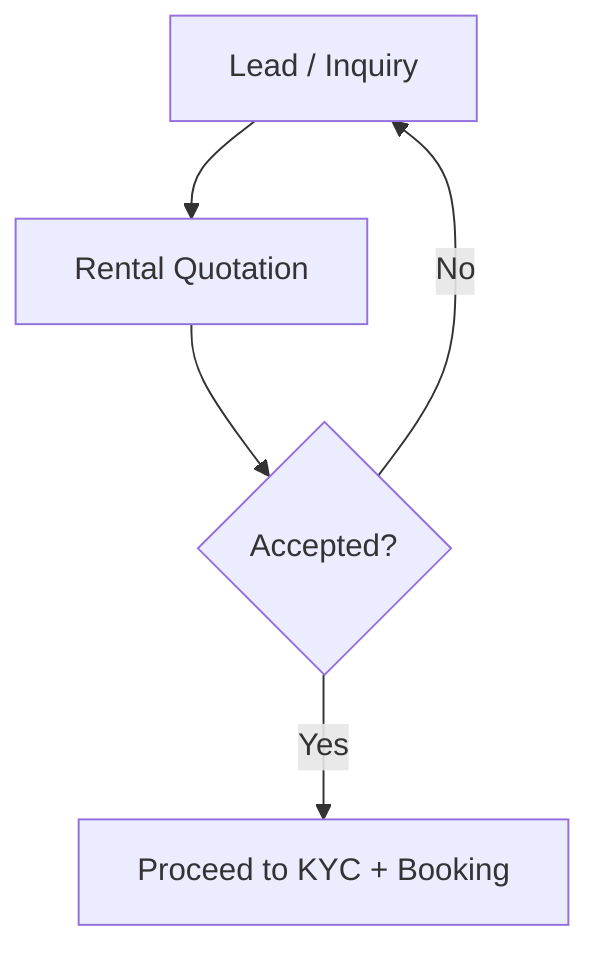

# Lead & Sales — Frappe: Functional Document

> **Product**: Asset Rental Platform
> **Domain**: Lead & Sales
> **Module**: `rental_core` — Inquiry & Conversion Pipeline
> **Document Type**: Functional
> **Audience**: Sales managers, business analysts, QA

---

## 1. Purpose & Scope

This document covers the pre-contract sales pipeline: capturing rental inquiries from multiple channels, generating quotations, tracking lead-to-agreement conversion, and scheduling follow-up tasks.

---

## 2. Business Requirements

| # | Requirement |
|---|---|
| BR-001 | The system must capture rental inquiries from multiple channels: web form, Flutter app, walk-in, and phone |
| BR-002 | Each inquiry must be traceable to a source (ads, referral, direct) |
| BR-003 | A formal quotation must be generatable from a lead with: asset, rental rate, deposit, duration, and inclusions |
| BR-004 | The system must track the lead-to-agreement conversion funnel |
| BR-005 | Follow-up tasks and callback scheduling must be assignable to sales staff |

---

## 3. User Stories

| ID | As a... | I want to... | So that... |
|---|---|---|---|
| US-001 | Rental Agent | Create a quotation from a lead | The customer has a formal written offer |

---

## 4. Workflow

---

## 5. Integration Points

| System | Direction | Purpose |
|---|---|---|
| **ERPNext CRM** | Outbound | Lead, Opportunity, Customer records |
