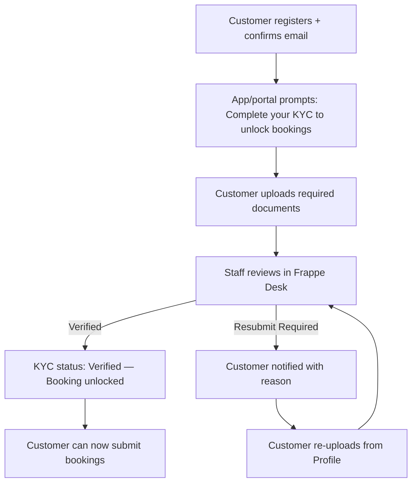

# Partner KYC — Frappe: Functional Document

> **Product**: Asset Rental Platform
> **Domain**: Partner KYC
> **Module**: `rental_core` — Customer Onboarding & Identity Verification
> **Document Type**: Functional
> **Audience**: Compliance officers, product owners, QA

---

## 1. Purpose & Scope

This document defines the customer onboarding lifecycle: customer classification (Individual vs. Company), KYC document submission and review, guarantor relationships, and the verification gate that must be passed before any booking is permitted.

---

## 2. Business Requirements

### 2.1 Customer & Classification

| # | Requirement |
|---|---|
| BR-010 | Customers must be classified as Individual or Company — different KYC checklists apply |
| BR-013 | A co-tenant or guarantor must be supportable on agreements (see §2.3 for guarantor workflow) |
| BR-014 | Customer records must store emergency contact information |

### 2.2 KYC Workflow

| # | Requirement |
|---|---|
| BR-011 | Required KYC document types must be configurable per deployment region |
| BR-012 | KYC documents must be stored securely and linked to the customer record |
| BR-015 | **KYC is a standalone pre-requisite workflow, separate from the booking flow.** A customer must have a KYC status of `Verified` before they are permitted to submit any booking request. |
| BR-016 | KYC submission is available as a dedicated step immediately after first login (prompted) and always accessible from the customer profile. It is not part of the booking form. |
| BR-017 | After a customer submits KYC documents, staff must review and set status: `Verified`, or `Resubmit Required` (with a typed reason — minimum 20 characters, matching the standard set in BR-077). |
| BR-018 | The system must send a push notification and email to the customer with the KYC review outcome. |
| BR-019 | If KYC is marked `Resubmit Required`, the customer must be able to re-upload from the portal or app independently. The KYC workflow screen must be re-accessible from the customer profile at any time. |
| BR-019a | KYC status values: `Not Submitted`, `Pending Review`, `Verified`, `Resubmit Required`. |
| BR-019b | **Only customers with KYC status `Verified` may submit a booking request.** Customers with any other KYC status who attempt to book must see a clear explanation and a link to complete or check their KYC status. |

### 2.3 Guarantor

| # | Requirement |
|---|---|
| GR-001 | The guarantor relationship is Surety. Guarantors are not billed during normal operation; they are notified at D+7 and D+14 overdue and can pay via the portal. |
| GR-002 | Guarantor portal access requires the dedicated `Guarantor` portal role. Access is field-level restricted to: agreement financial summary (amount owed, due date, balance), guarantor's own KYC status, and the invoice payment screen. No access to the full agreement DocType or tenant personal data. |

---

## 3. User Stories

| ID | As a... | I want to... | So that... |
|---|---|---|---|
| US-006 | Rental Agent | Upload a customer's KYC documents | Compliance is maintained |
| US-KYC1 | Customer | Submit my ID documents from my phone or browser | I can unlock the booking feature |
| US-KYC2 | Customer | See why my KYC was rejected and re-upload | I can fix the issue without calling the office |

---

## 4. Workflow

### 4.1 Standalone KYC Workflow

---

## 5. Business Rules

1. **A booking can only be submitted by a customer whose KYC status is `Verified`.** Any attempt to book with status `Not Submitted`, `Pending Review`, or `Resubmit Required` must be blocked with a clear explanation and a link to the KYC workflow.
2. **The booking form must NOT include a KYC upload step.** KYC is completed as a separate pre-requisite workflow.

---

## 6. Security Requirements

| Requirement | Description |
|---|---|
| **KYC documents** | Stored in S3/MinIO; access via short-lived signed URLs only |
| **Data residency** | KYC document storage must use a bucket in the same geographic region as the client's operations to comply with data residency laws (e.g., KSA PDPL, UAE DPL) |
| **Customer data isolation** | Portal API endpoints filter strictly by `frappe.session.user` — no cross-customer data |
