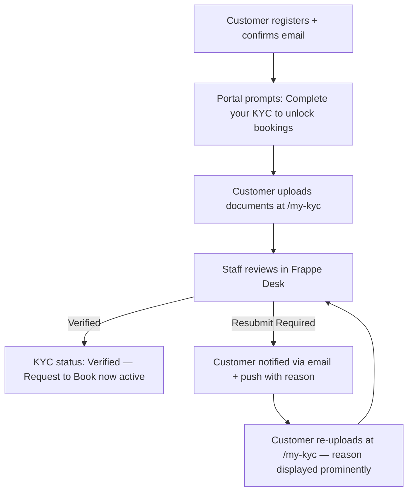

# Partner KYC — Web: Functional Document

> **Product**: Asset Rental Platform
> **Domain**: Partner KYC
> **Module**: Customer-Facing Website — Registration & KYC Portal
> **Document Type**: Functional
> **Audience**: UX designers, frontend developers, QA

---

## 1. Purpose & Scope

This document defines the customer registration flow, the KYC profile page (`/my-kyc`), and the guarantor portal on the web layer. KYC is a standalone pre-requisite — not embedded in the booking form.

---

## 2. Page Requirements

### 2.1 Registration (`/rental-signup`)

| # | Requirement |
|---|---|
| WR-050 | New customers must be able to register without an invitation |
| WR-051 | After email confirmation, the user must be redirected to their intended booking URL |
| WR-052 | Existing email addresses must be rejected with a clear message |

### 2.2 KYC Profile (`/my-kyc`)

| # | Requirement |
|---|---|
| WR-019a | `/my-kyc` must be accessible immediately after first login and from the customer profile menu at any time |
| WR-019b | The page must display the customer's current KYC status: `Not Submitted`, `Pending Review`, `Verified`, or `Resubmit Required` |
| WR-019c | If status is `Not Submitted` or `Resubmit Required`, the customer must be able to upload the required documents (types defined by region configuration). If `Resubmit Required`, the rejection reason from staff must be displayed prominently above the upload form. |
| WR-019d | If status is `Pending Review`, the page must show a "Your documents are under review" message with no upload option (prevents duplicate submissions) |
| WR-019e | If status is `Verified`, the page must show a confirmation badge and the date verified |

### 2.3 Guarantor Portal

| # | Requirement |
|---|---|
| WR-060 | Guarantors must be able to log in to the portal using the dedicated `Guarantor` portal role |
| WR-061 | Guarantor access is field-level restricted to: the agreement financial summary (amount owed, due date, outstanding balance), the guarantor's own KYC status, and the invoice payment page |
| WR-062 | Guarantors must NOT have access to the full agreement DocType, tenant personal data, or any portal pages beyond their restricted scope |
| WR-063 | The guarantor payment page (`/pay/{invoice}`) must function identically to the tenant version — online payment or bank transfer instructions |

---

## 3. User Stories

| ID | As a... | I want to... | So that... |
|---|---|---|---|
| WS-006 | Customer | Upload my ID documents from my browser | I can complete KYC without visiting an office |
| WS-KYC1 | Customer | See my KYC status on my profile | I know if I can book or need to re-upload |
| WS-GR1 | Guarantor | Log in and pay an overdue invoice | I can fulfil my surety obligation |

---

## 4. Workflow

---

## 5. Security Requirements

| Requirement | Description |
|---|---|
| **Portal auth wall** | All `/my-*` routes redirect to `/login` for guest access |
| **KYC upload** | Files uploaded to S3; Frappe stores only the CDN URL |
| **Customer isolation** | All portal API endpoints filter strictly by `frappe.session.user` |
