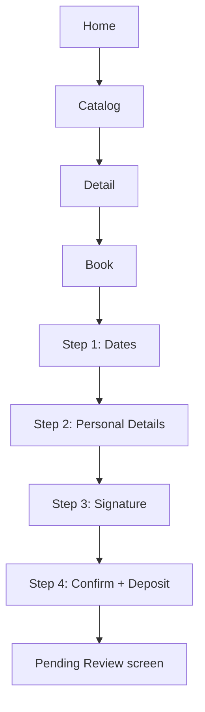

# Rental Contracting — Flutter: Functional Document

> **Product**: Asset Rental Platform
> **Domain**: Rental Contracting
> **Module**: Customer Mobile App — Booking Flow & My Rentals
> **Document Type**: Functional
> **Audience**: UX designers, mobile developers, QA

---

## 1. Purpose & Scope

This document defines the multi-step booking flow, the pending review experience, self-cancellation, and the My Rentals screen in the Flutter app.

---

## 2. Screen Requirements

### 2.1 Booking Flow

| # | Requirement |
|---|---|
| FR-041 | The booking flow must be multi-step with a visible progress indicator |
| FR-042 | Step 1: date selection with live rent calculation |
| FR-043 | Step 2: personal details (pre-filled if customer record exists) |
| FR-044 | Step 3: digital signature drawn on a canvas pad |
| FR-045 | Step 4: confirmation with deposit payment method choice |
| FR-046 | Submission must create a Draft Agreement and immediately move the asset to `Reserved`. The confirmation screen must show: a "Pending Review" status, the maximum review window (e.g. "You will hear back within 48 hours"), and a **"Cancel Request" button** allowing the customer to self-cancel before staff acts. |
| FR-047 | Each step must validate locally before allowing advance |
| FR-047a | Completed booking form steps must be auto-saved to local storage. On session timeout or app restart, the user must resume from the last completed step without re-entering data. |
| FR-048 | If the booking is **approved** by staff, the customer must receive a push notification navigating to their active agreement |
| FR-049 | If the booking is **rejected** by staff, the customer must receive a push notification showing the rejection reason |
| FR-050 | If the booking **auto-expires** (no staff action within the expiry window), the customer must receive a push notification |

### 2.2 My Rentals

| # | Requirement |
|---|---|
| FR-055 | Active and past agreements must be listed with status, asset, dates. **Pending (unreviewed) bookings must appear in this list with a distinct "Pending Review" status badge** — they must not be mixed with active agreements or hidden until activation. |
| FR-056 | Tapping an agreement must open a detail view with upcoming invoices |
| FR-057 | The customer must see only their own agreements |

---

## 3. User Stories

| ID | As a... | I want to... | So that... |
|---|---|---|---|
| FS-004 | Prospective tenant | Complete the entire booking on my phone | I don't need to visit an office |
| FS-008 | Active tenant | Download my signed agreement | I have a copy anywhere |

---

## 4. Workflow

---

## 5. Business Rules

1. Booking submission creates a Draft Agreement and immediately moves the asset to `Reserved`.
2. The "pending review" state must be clearly communicated; the maximum review window must be shown; a self-cancel option must be visible.
3. The app requires live network for booking submission; offline booking is not supported.
4. Document downloads open the device's native PDF viewer or browser.
5. Suspended or legally flagged accounts may: view agreements, download documents. They may NOT: submit new bookings.
6. Canvas e-signature is a convenience acknowledgement only — not legally certified.
