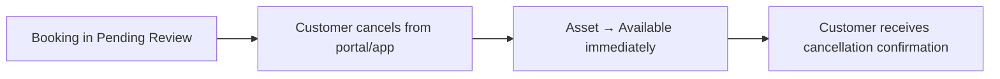
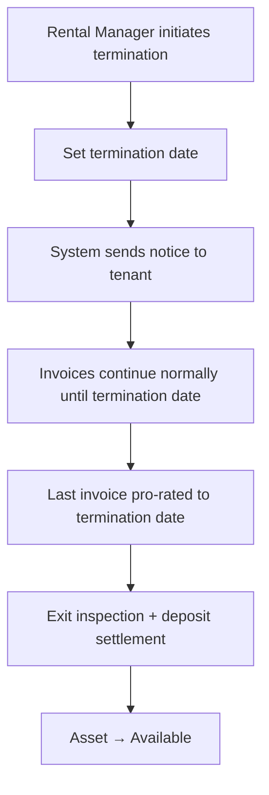

# Rental Contracting — Frappe: Functional Document

> **Product**: Asset Rental Platform
> **Domain**: Rental Contracting
> **Module**: `rental_core` — Agreements, Booking & Termination
> **Document Type**: Functional
> **Audience**: Operations managers, legal, QA

---

## 1. Purpose & Scope

This document defines the rental agreement lifecycle: drafting, digital signature, activation, renewal, open-ended termination, and exit inspection. It also covers the booking submission and self-cancellation flows.

---

## 2. Business Requirements

### 2.1 Rental Agreement

| # | Requirement |
|---|---|
| BR-030 | A rental agreement must capture: asset, customer, dates, billing cycle, rate, deposit, and clauses |
| BR-031 | Agreements must support open-ended (no fixed end date) and fixed-term periods |
| BR-031a | Open-ended agreements can only be terminated by a Rental Manager or above. The Rental Manager sets a termination date; invoices continue pro-rated until that date. Default minimum notice period: 30 days (overridable per agreement by the Rental Manager). The system sends a termination notice to the tenant on the same day termination is initiated. |
| BR-032 | A PDF agreement must be auto-generated from a template on activation |
| BR-033 | Tenants sign the agreement using a canvas e-signature. **This signature is a convenience acknowledgement recording intent — it is NOT a legally certified signature.** Platform documentation must state this explicitly. On the first agreement submission in any client site, Frappe Desk must display a one-time advisory. |
| BR-034 | Agreement versioning must be maintained — all revisions stored with timestamps |
| BR-035 | Additional recurring charges (parking, utilities, insurance surcharge) must be line-itemisable on agreements |
| BR-036 | **The booking form must NOT include a KYC upload step.** KYC is completed as a separate pre-requisite workflow. The booking form assumes `KYC Verified` status has already been achieved. |

### 2.2 Booking Self-Cancellation

| # | Requirement |
|---|---|
| BR-080 | Customers with a pending booking must be able to **self-cancel** from the portal or app before the internal team reviews it. Self-cancellation returns the asset to `Available` immediately and sends confirmation to the customer. |
| BR-080a | To prevent asset-blocking abuse, a configurable maximum self-cancel count per customer per rolling 30-day window must be enforced (default: 3, set in `Rental Configuration`). After the limit is reached, the customer must contact the office to cancel. |

---

## 3. User Stories

| ID | As a... | I want to... | So that... |
|---|---|---|---|
| US-002 | Rental Manager | Activate a signed agreement | The billing cycle starts automatically |
| US-RC1 | Customer | Self-cancel my pending booking | I can change my mind before it's reviewed |

---

## 4. Workflows

### 4.1 Booking Self-Cancellation

### 4.2 Open-Ended Agreement Termination

---

## 5. Business Rules

1. Customers can self-cancel a `Pending Review` booking at any time before staff action; asset returns to `Available` immediately. Self-cancel is limited to a configurable maximum per rolling 30-day window (default: 3).
2. Business-initiated termination (eviction/breach) requires an exit inspection before the asset is freed. The deposit settlement flow is identical to a normal agreement end.
3. Annual rent escalation beyond the configured per-country maximum requires a written justification logged by the Rental Manager.
4. Canvas e-signature is a convenience acknowledgement only — not a legally certified instrument.

---

## 6. Security Requirements

| Requirement | Description |
|---|---|
| **Signature data** | Base64 canvas data stored in Long Text; not exposed via public API |
| **Deposit ledger** | Write access restricted to Accountant and Rental Manager roles |
