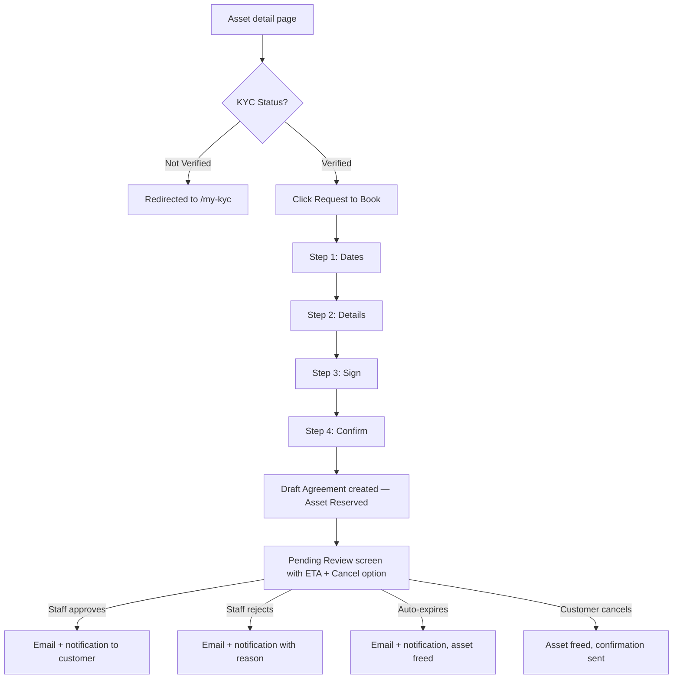

# Rental Contracting — Web: Functional Document

> **Product**: Asset Rental Platform
> **Domain**: Rental Contracting
> **Module**: Customer-Facing Website — Booking Form & My Rentals
> **Document Type**: Functional
> **Audience**: UX designers, frontend developers, QA

---

## 1. Purpose & Scope

This document defines the multi-step booking form, the pending review experience, self-cancellation, and the My Rentals portal page on the web layer.

---

## 2. Page Requirements

### 2.1 Booking Form (`/rentals/{asset}/book`)

| # | Requirement |
|---|---|
| WR-020 | The page must be login-gated — guests are redirected to login and returned after auth |
| WR-020a | The page must additionally be **KYC-gated**: if the customer's KYC status is not `Verified`, they must be redirected to `/my-kyc` with a message: *"You need to complete identity verification before booking"* |
| WR-021 | The form must be multi-step with a visible progress indicator |
| WR-022 | Step 1: date selection with live pricing preview (total rent + deposit) |
| WR-023 | Step 2: personal details (pre-filled if the customer has an existing record) |
| WR-024 | Step 3: digital signature on a canvas pad |
| WR-025 | Step 4: booking confirmation with deposit payment method choice (online / bank transfer) |
| WR-026 | Each step must validate before allowing advance to the next |
| WR-027 | Submission must create a Draft Agreement and notify the internal team — not auto-activate. The asset moves to `Reserved` immediately on submission. |
| WR-028 | The post-submission confirmation screen must display: a "Pending Review" status indicator and the maximum review window (e.g. "You will hear back within 48 hours") derived from the `Rental Configuration` draft expiry window |
| WR-029 | The customer must be able to **self-cancel** their pending booking from the portal before the internal team acts. A "Cancel Request" button must be visible on the pending confirmation screen. |
| WR-030 | Completed booking form steps must be auto-saved to the browser session. On session timeout, the user must resume from the last completed step without re-entering data. |

### 2.2 My Rentals (`/my-rentals`)

| # | Requirement |
|---|---|
| WR-040 | Show active and past agreements with status, asset name, dates, next invoice. **Pending (unreviewed) bookings must appear in this list with a distinct "Pending Review" status badge** — they must not be mixed with active agreements or hidden until activation. |
| WR-047 | New asset booking must be **blocked** for suspended or legal-flagged accounts — the "Request to Book" CTA must be replaced with the "Account on hold" state. |

### 2.3 Documents (`/my-documents`)

| # | Requirement |
|---|---|
| WR-042 | Links to signed agreement PDFs, receipts, and KYC documents. **Document download must remain accessible even when the account is suspended or under legal flag.** |

---

## 3. User Stories

| ID | As a... | I want to... | So that... |
|---|---|---|---|
| WS-003 | Prospective customer | Click "Login to Book" and be returned to the same page after login | I don't lose my context |
| WS-004 | Customer | Complete the booking form on a desktop browser | I don't need to install an app |
| WS-005 | Customer | See my total rent and deposit before confirming | No surprise costs |
| WS-007 | Customer | Sign the agreement digitally on screen | I don't need to print and scan |
| WS-009 | Active tenant | Download my signed agreement | I have a copy for my records |

---

## 4. Workflow

---

## 5. Business Rules

1. Booking submission moves the asset to `Reserved` immediately. The form creates a **Draft** agreement — the internal team reviews and activates it; there is no automatic activation from the web.
2. The deposit payment method selected on the web (online / bank transfer) is advisory — the internal team processes the actual payment.
3. A customer with a pending booking can self-cancel at any time before staff action (subject to the configurable maximum cancel limit per rolling 30-day window).
4. Suspended or legally flagged accounts may still: view agreements and download documents. They may NOT: submit new bookings.

---

## 6. Security Requirements

| Requirement | Description |
|---|---|
| **Portal auth wall** | `/rentals/{asset}/book` redirects to `/login` for guest access |
| **Signature storage** | Canvas base64 stored server-side only; not re-served via public URL |
