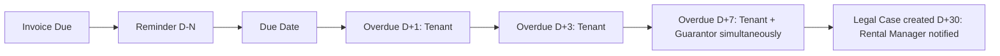

# Notifications & Escalation — Frappe: Functional Document

> **Product**: Asset Rental Platform
> **Domain**: Notifications & Escalation
> **Module**: `rental_core` — Reminders, Escalation & Audit
> **Document Type**: Functional
> **Audience**: Operations managers, customer service, QA

---

## 1. Purpose & Scope

This document defines the notification lifecycle: payment reminders, overdue escalation, booking status notifications, contract renewal alerts, legal case creation, and the audit trail for all notification sends.

---

## 2. Business Requirements

### 2.1 Payment Reminders & Escalation

| # | Requirement |
|---|---|
| BR-070 | Payment reminders must be sent N days before the due date (configurable per client) |
| BR-071 | Overdue escalation must follow a defined schedule: D+1, D+3, D+7, D+14 after due date. At D+14, reminders are sent to both tenant and guarantor simultaneously. |
| BR-072 | Contract renewal alerts must be sent 30/60/90 days before expiry (configurable) |
| BR-073 | Notifications must be deliverable via Email, SMS, WhatsApp, and mobile push |
| BR-074 | All notification sends (success and failure) must be audit-logged |
| BR-075 | Escalation path: Tenant (D+1, D+3, D+7, D+14) → Guarantor (D+7 simultaneously, D+14 simultaneously) → Legal Case auto-created (D+30) |

### 2.2 Booking Status Notifications

| # | Requirement |
|---|---|
| BR-076 | When a Draft Agreement is **approved**, the customer must receive a push notification and email confirming approval |
| BR-077 | When a Draft Agreement is **rejected**, the customer must receive a push notification and email with the internal team's typed rejection reason. The rejection reason field requires a **minimum of 20 characters**. The staff UI must show a character counter and sample placeholder text. |
| BR-077a | The rejection reason is stored on the Draft Agreement record and is visible to the customer in the portal and app. |
| BR-078 | When a Draft Agreement **auto-expires** (draft expiry window elapsed with no action), the customer must receive a push notification and email |
| BR-079 | The pending booking confirmation screen (portal and app) must display the maximum review window derived from the configurable draft expiry window (e.g. "You will hear back within 48 hours") |
| BR-080 | Customers with a pending booking must be able to **self-cancel** from the portal or app before the internal team reviews it. Self-cancellation returns the asset to `Available` immediately and sends confirmation to the customer. |
| BR-080a | To prevent asset-blocking abuse, a configurable maximum self-cancel count per customer per rolling 30-day window must be enforced (default: 3). |

### 2.3 Legal Escalation

| # | Requirement |
|---|---|
| LE-001 | At D+30 overdue, a `Legal Case` DocType is created automatically and the Rental Manager is notified. |

---

## 3. Workflow

### 3.1 Notification Escalation

---

## 4. Business Rules

1. All notification channel attempts (email, SMS, push) are logged regardless of success or failure.
2. The guarantor relationship is Surety. Guarantors are not billed during normal operation; they are notified at D+7 and D+14 overdue and can pay via the portal.

---

## 5. Integration Points

| System | Direction | Purpose |
|---|---|---|
| **Email provider** | Outbound | Transactional notification emails |
| **SMS provider** (Twilio/local) | Outbound | Transactional SMS reminders |
| **FCM** | Outbound | Mobile push notifications to Flutter app |
