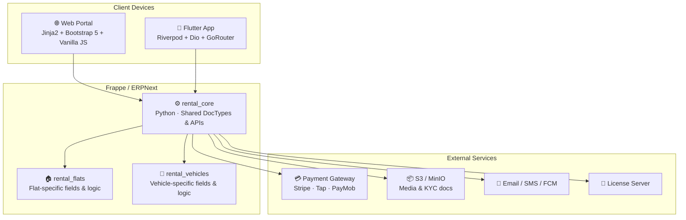
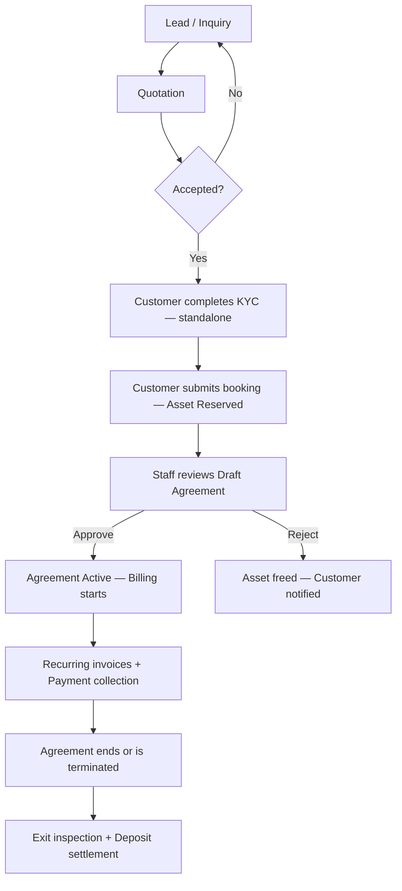

# Base — Platform Overview

> **Product**: Asset Rental Platform
> **Layer**: Base (shared across Flats & Vehicles variants)
> **Purpose**: Architecture summary, feature map, and user personas — one-page reference for all stakeholders

---

## 1. What This Platform Does

A **multi-tenant, white-label rental management platform** built on Frappe/ERPNext. It handles the complete lifecycle of renting physical assets — from lead capture through billing, payment collection, and deposit settlement.

The platform ships as a Frappe app (`rental_core`) with two optional child apps (`rental_flats`, `rental_vehicles`) and a Flutter mobile app (`rental_app`). Each client gets an independent site with region-specific configuration.

---

## 2. Architecture



| Layer | Technology | Role |
|---|---|---|
| **Backend** | Frappe 15 / ERPNext 15, Python 3.11+ | DocTypes, business logic, API, scheduler |
| **Web Portal** | Jinja2 templates, Bootstrap 5, Vanilla JS | SSR catalog, booking form, customer portal |
| **Mobile App** | Flutter 3.x, Dart, Riverpod | White-label customer app for iOS/Android |
| **Storage** | S3 / MinIO | Asset photos, KYC documents, agreement PDFs |
| **Payments** | Stripe, Tap, PayMob, Bank Transfer | Region-configurable gateway routing |
| **Notifications** | Email, SMS (Twilio), FCM push | Multi-channel with audit log |

---

## 3. Core DocTypes

| DocType | Purpose |
|---|---|
| `Rental Configuration` | Singleton — per-site settings (currency, tax, gateway, KYC types, grace period) |
| `Rental Asset` | Any rentable item with lifecycle status (`Available → Reserved → Rented → Maintenance → Retired`) |
| `Rental Lead` | Inquiry from any channel (web, app, walk-in, phone) |
| `Rental Quotation` | Formal offer generated from a lead |
| `Rental Agreement` | Contract linking asset ↔ customer with billing cycle, deposit, e-signature |
| `Deposit Ledger` | Tracks deposit held, deductions, refunds — separate from rent |
| `Asset Inspection` | Entry/exit inspection with photos, damage notes, repair cost |
| `Rental Notification Log` | Audit trail for every notification attempt (all channels) |
| `Payment Webhook Log` | Idempotency log for gateway webhook events |

---

## 4. Feature Map

| Domain | Key Capabilities |
|---|---|
| **Configuration** | Multi-region (currency, tax, gateway, language, KYC types), license enforcement with grace mode, role-based access |
| **Lead & Sales** | Multi-channel inquiry capture, quotation generation, conversion funnel tracking |
| **Partner KYC** | Individual/Company classification, configurable document types, standalone verification workflow, guarantor portal |
| **Asset Management** | Lifecycle status machine, availability calendar, concurrency-safe reservation (row lock), SEO-optimised catalog |
| **Rental Contracting** | Multi-step booking, canvas e-signature (acknowledgement only), open-ended & fixed-term agreements, self-cancellation, exit inspection |
| **Accounting** | Recurring billing via ERPNext Subscription, partial payments, late fees, deposit ledger with dispute window, webhook idempotency |
| **Notifications** | Payment reminders (D-N), overdue escalation (D+1→D+3→D+7→D+14→Legal D+30), multi-channel with audit log |
| **Reporting** | Occupancy rate, revenue by asset/location, collection efficiency, tenant LTV, asset ROI, churn analysis |

---

## 5. User Personas

| Persona | Role | Description | Primary Touchpoint |
|---|---|---|---|
| 🏢 **Platform Owner** | System Manager | Deploys and configures the platform for a client. Manages license, regions, and integrations. | Frappe Desk |
| 👔 **Operations Lead** | Rental Manager | Oversees all rental operations. Approves/rejects bookings, manages agreements, handles disputes, initiates terminations. | Frappe Desk |
| 🤝 **Sales Agent** | Rental Agent | Front-line staff. Captures leads, generates quotations, uploads KYC documents, schedules follow-ups. | Frappe Desk |
| 💼 **Finance Officer** | Accountant | Manages invoices, processes payments, handles deposit refunds, runs financial reports. | Frappe Desk |
| 🏠 **Individual Tenant** | Customer | A person renting a flat or vehicle. Browses catalog, completes KYC, books assets, pays invoices, downloads documents. | Web Portal / Flutter App |
| 🏗️ **Company Tenant** | Customer | A business renting assets (e.g., fleet vehicles, corporate housing). Same flow as Individual but with B2B tax invoicing. | Web Portal / Flutter App |
| 🛡️ **Guarantor** | Guarantor | Surety for a tenant. Receives overdue notifications at D+7/D+14. Can log in to a restricted portal to view outstanding balance and pay. | Web Portal |

---

## 6. User Stories (Summary)

| ID | Persona | Story | Domain |
|---|---|---|---|
| US-001 | Rental Agent | Create a quotation from a lead | Lead & Sales |
| US-002 | Rental Manager | Activate a signed agreement so billing starts automatically | Rental Contracting |
| US-003 | Accountant | See all overdue invoices with aging to prioritise collections | Accounting / Reporting |
| US-004 | Customer | View my active agreement and upcoming invoices | Rental Contracting / Accounting |
| US-005 | Customer | Pay my invoice online without visiting an office | Accounting |
| US-006 | Rental Agent | Upload a customer's KYC documents for compliance | Partner KYC |
| US-007 | Rental Manager | Configure grace period and late fee per client | Configuration |
| US-008 | Accountant | Process a deposit refund with documented deductions | Accounting |

---

## 7. Key Workflows

### 7.1 Full Rental Lifecycle



### 7.2 Overdue Escalation

```
D-N → Reminder · D+1 → Tenant · D+3 → Tenant · D+7 → Tenant + Guarantor · D+14 → Tenant + Guarantor · D+30 → Legal Case
```

---

## 8. Domain Documentation Index

> Detailed functional requirements are in the domain-specific docs:

| # | Domain | Docs |
|---|---|---|
| 01 | [[01 - Base Configuration/frappe-functional\|Base Configuration]] | Frappe · Web · Flutter |
| 02 | [[02 - Lead & Sales/frappe-functional\|Lead & Sales]] | Frappe · Web · Flutter |
| 03 | [[03 - Partner KYC/frappe-functional\|Partner KYC]] | Frappe · Web · Flutter |
| 04 | [[04 - Asset Management/frappe-functional\|Asset Management]] | Frappe · Web · Flutter |
| 05 | [[05 - Rental Contracting/frappe-functional\|Rental Contracting]] | Frappe · Web · Flutter |
| 06 | [[06 - Accounting/frappe-functional\|Accounting]] | Frappe · Web · Flutter |
| 07 | [[07 - Notifications & Escalation/frappe-functional\|Notifications & Escalation]] | Frappe · Web · Flutter |
| 08 | [[08 - Reporting/frappe-functional\|Reporting]] | Frappe · Web · Flutter |

---

## 9. Related

- [[Base MOC|🧱 Base MOC]]
- [[../Asset Rental MOC|🏢 Asset Rental MOC]]
