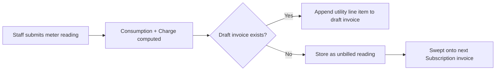

# Utility Billing — Frappe: Functional Document

> **Product**: Asset Rental Platform — Flat Variant
> **Domain**: Utility Billing
> **Module**: `rental_flats` — Meter Readings & Consumption Charges
> **Document Type**: Functional
> **Audience**: Property managers, accountants, QA

---

## 1. Purpose & Scope

This document defines the monthly meter reading workflow, automatic consumption calculation, charge injection into invoices, and the reminder system for missing readings.

---

## 2. Business Requirements

| # | Requirement |
|---|---|
| FR-020 | Staff must be able to submit monthly meter readings for electricity, water, and gas |
| FR-021 | Previous reading must be auto-populated from the last submitted entry for the same flat and meter type |
| FR-022 | Consumption must be automatically computed: `current_reading − previous_reading` |
| FR-023 | The charge must be automatically computed: `consumption × rate_per_unit` (from `Rental Configuration`) |
| FR-024 | The utility charge must be **automatically injected into the current billing cycle's draft invoice** |
| FR-025 | If no draft invoice exists at reading time, the charge must be stored as "unbilled" and swept onto the next invoice |
| FR-026 | A reminder must be sent to the Property Manager on the 25th of each month to submit readings for all active flat agreements |
| FR-027 | A missing reading alert must be triggered if an active flat agreement has no reading submitted for the current month |

---

## 3. Workflow

---

## 4. Business Rules

1. Utility billing applies only if `custom_utilities_included = 0` on the flat asset.
2. Utility readings are submitted by staff — tenants can view history but cannot submit readings.
3. A reading without a prior reading for the same meter/flat will use the provided reading as both previous and current (net zero consumption) and log a warning.
4. **Guarantor utility visibility**: Guarantors do NOT see the tenant's utility charges or readings in the restricted guarantor portal.

---

## 5. Integration Points

| System | Direction | Purpose |
|---|---|---|
| ERPNext Subscription | Inbound hook | Trigger utility billing sweep on invoice creation |
| Email notification | Outbound | Meter reading reminders on the 25th |
