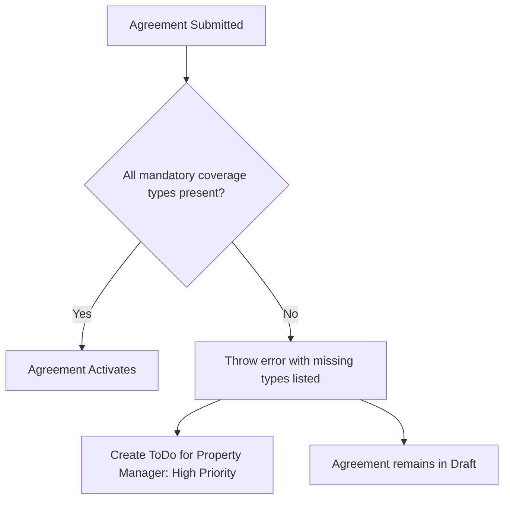

# Insurance — Frappe: Functional Document

> **Product**: Asset Rental Platform — Flat Variant
> **Domain**: Insurance Validation
> **Module**: `rental_flats` — Country-Specific Coverage & Agreement Gating
> **Document Type**: Functional
> **Audience**: Property managers, legal, QA

---

## 1. Purpose & Scope

This document defines the insurance policy tracking and the mandatory coverage validation that gates agreement activation. Insurance management is entirely Desk-based — customers never see insurance status.

---

## 2. Business Requirements

| # | Requirement |
|---|---|
| FR-040 | `Rental Configuration` must specify per-country mandatory insurance coverage types (e.g. Earthquake is mandatory in Turkey; Flood in certain EU regions) |
| FR-041 | When a rental agreement is submitted for a flat, the system must check that all mandatory coverage types for the configured country are covered by an active, non-expired policy |
| FR-042 | If mandatory coverage is missing, the agreement submission must be **blocked** with a clear message naming the missing coverage types |
| FR-043 | On blocking, an internal `ToDo` task must be automatically created and assigned to the property manager with High priority |
| FR-044 | The ToDo must link to the blocked agreement and list the missing coverage types |
| FR-045 | Insurance policies must track: provider, policy number, coverage type, start/expiry dates, coverage amount, premium amount, and policy document |
| FR-046 | Alerts must fire 30 days and 7 days before any policy expires |

---

## 3. User Stories

| ID | As a... | I want to... | So that... |
|---|---|---|---|
| FS-003 | Property Manager | Be alerted when mandatory insurance is missing | I fix it before it blocks a new agreement |
| FS-004 | Rental Manager | Have the system block a non-insured agreement | No legal or financial risk is taken |

---

## 4. Workflow

---

## 5. Business Rules

1. An insurance gap at agreement submission time **blocks** the agreement and creates a ToDo — it does not auto-suspend an already-active agreement.
2. Insurance is Desk-only — customers never see insurance status on any customer-facing page or app screen.
