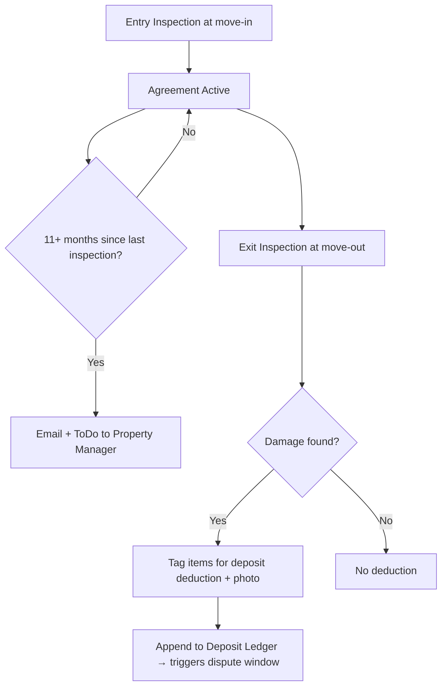

# Flat Inspection — Frappe: Functional Document

> **Product**: Asset Rental Platform — Flat Variant
> **Domain**: Flat Inspection
> **Module**: `rental_flats` — Room-by-Room Checklists & Deposit Deductions
> **Document Type**: Functional
> **Audience**: Property managers, QA

---

## 1. Purpose & Scope

This document defines the flat-specific inspection workflow: entry and exit checklists covering rooms, appliances, and building items. Exit inspections generate deposit deductions with photo evidence.

---

## 2. Business Requirements

| # | Requirement |
|---|---|
| FR-050 | Every agreement must have an entry and exit inspection |
| FR-051 | Inspections must cover room-by-room: Living Room, Bedrooms (1–4), Kitchen, Bathrooms (1–2), Balcony, Storage, Building items (keys, remote, parking pass) |
| FR-052 | Each checklist item has: condition (Excellent/Good/Fair/Damaged/Missing), notes, and photo |
| FR-053 | Damage items on exit inspection must be tagged for deposit deduction with an estimated repair cost |
| FR-054 | If no inspection has been submitted in > 11 months for an active agreement, a reminder must be sent to the property manager via **email and Frappe ToDo** (consistent with base notification channels). |

---

## 3. User Stories

| ID | As a... | I want to... | So that... |
|---|---|---|---|
| FS-007 | Property Manager | Create an annual inspection reminder | I'm compliant with inspection obligations |

---

## 4. Workflow

---

## 5. Business Rules

1. Damage costs from exit inspection deductions must have justification text and a photo before they are committed to the deposit ledger.
2. Annual inspection reminders fire if no inspection of any type is logged for the agreement in the past 11 months.
3. Appliance conditions are updated during entry and exit inspections — the flat's appliance record reflects the current state.
