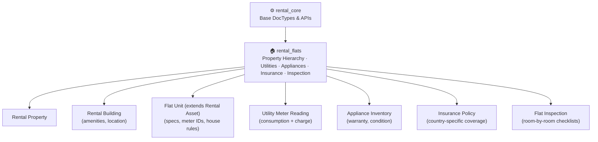
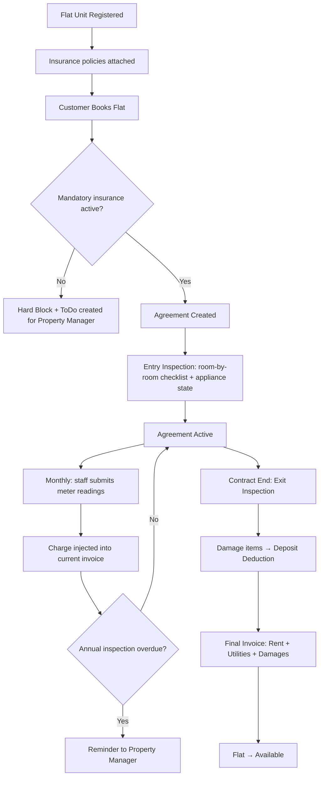
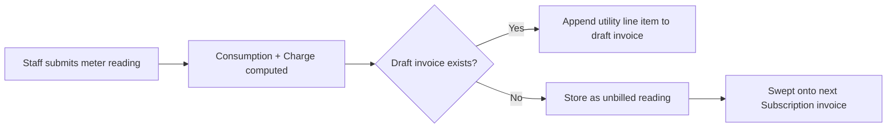
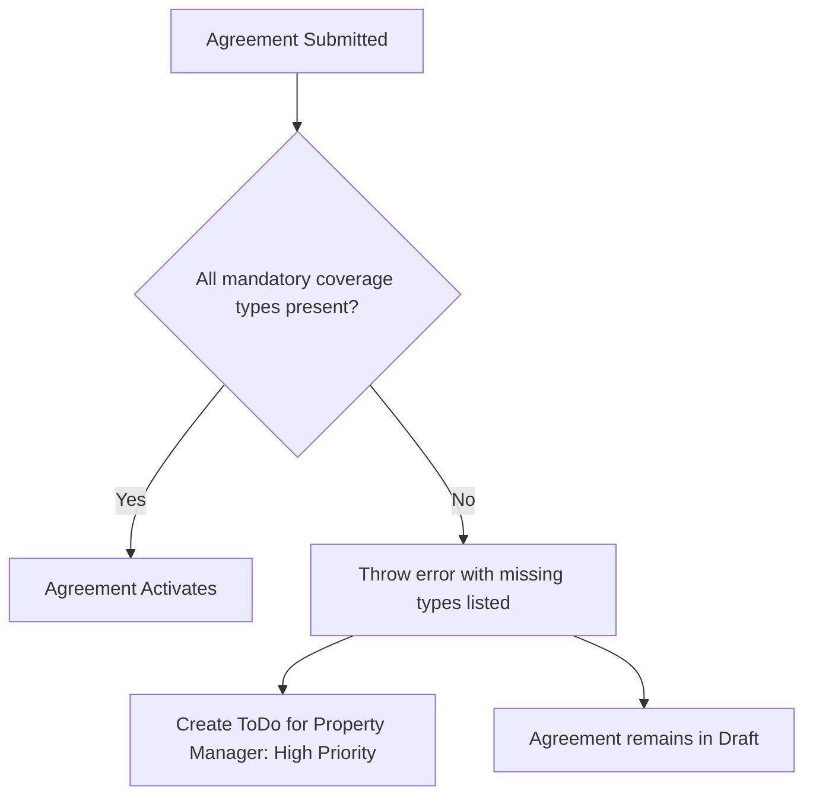
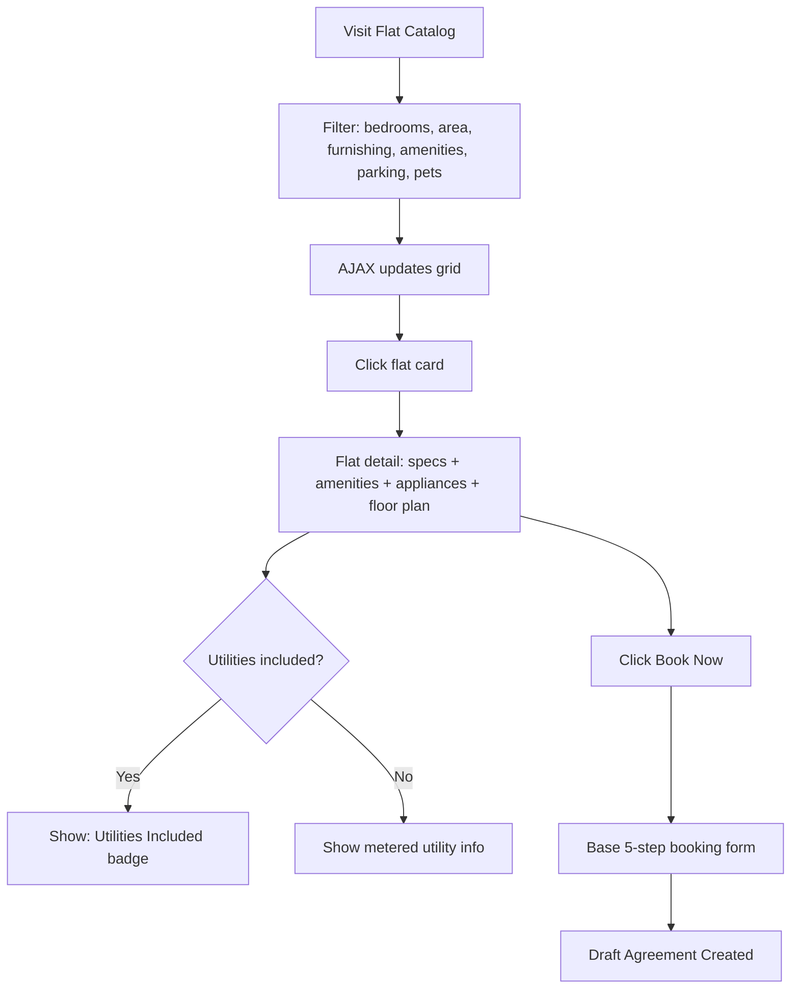
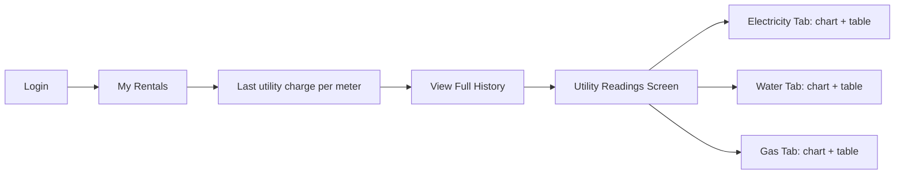

# Flats — Variant Overview

> **Product**: Asset Rental Platform — Flat Variant
> **App**: `rental_flats` (extends `rental_core`)
> **Purpose**: Architecture summary, Core DocTypes, Feature Map, Personas, User Stories, and Key Workflows.

---

## 1. What This Variant Adds

`rental_flats` extends the base platform with everything unique to property/flat rental. It does **not** duplicate agreement, billing, deposit, or notification logic — those are inherited from `rental_core`.

---

## 2. Architecture

---

## 3. Core DocTypes & Schema Additions

| DocType | Purpose | Key Fields |
|---|---|---|
| `Rental Property` | Top-level grouping of buildings by ownership or location | property name, owner, location |
| `Rental Building` | Physical building within a property; holds shared amenities | building name, property link, amenities (Pool, Gym, Parking, Security, Elevator) |
| `Flat Unit` (extends `Rental Asset`) | A single rentable residential unit | unit number, floor, gross area (m²), living area (m²), bedrooms, bathrooms, balcony, storage room, parking slot, furnishing level, direction facing, view type, meter IDs (electricity, water, gas), utilities_included flag, house rules (max occupants, pets, smoking), floor plan attachment |
| `Utility Meter Reading` | Monthly meter snapshot that drives billing | flat_id, meter_type (`Electricity` / `Water` / `Gas`), previous_reading (auto-populated), current_reading, consumption (computed), charge (computed), billing status (`Billed` / `Unbilled`) |
| `Appliance` (child table on Flat Unit) | Tracks individual items inside a furnished flat | name, brand, model, serial number, purchase date, warranty expiry, condition (`Excellent` / `Good` / `Fair` / `Damaged` / `Missing`) |
| `Insurance Policy` | Coverage documents linked to a flat for compliance gating | provider, policy number, coverage type, start/expiry dates, coverage amount, premium amount, policy document |
| `Flat Inspection` | Room-by-room entry/exit checklist with photo evidence | agreement_id, type (`Entry` / `Exit`), room checklist (Living Room, Bedrooms 1–4, Kitchen, Bathrooms 1–2, Balcony, Storage, Building items), per-item condition + notes + photo, damage items with estimated repair cost |

---

## 4. Feature Map

| Domain | Key Capabilities | Customer-Facing? |
|---|---|---|
| **Property & Unit Registry** | 3-level hierarchy (Property → Building → Unit), flat attributes, floor plans, bulk operations | ✅ Catalog + detail pages |
| **Utility Billing** | Monthly meter readings, auto-consumption calc, invoice injection, unbilled sweep, reminders | ✅ Read-only history + charts |
| **Appliance Management** | Inventory per flat, warranty countdown, condition tracking during inspections | ✅ Read-only list on detail |
| **Insurance** | Country-specific mandatory coverage, agreement gating, policy expiry alerts, ToDo creation | ❌ Desk-only |
| **Flat Inspection** | Room-by-room checklists, photo evidence, damage → deposit deduction, periodic reminders | ⚠️ Exit deductions only |

---

## 5. Flat-Specific Personas

| Persona | Role | What They Do Here | Touchpoint |
|---|---|---|---|
| 🏗️ **Property Manager** | Property Manager | Manages properties/buildings/units, submits meter readings, handles inspections, receives insurance and warranty alerts | Frappe Desk |
| 🏠 **Flat Tenant** | Customer | Browses catalog with flat filters, views amenities/appliances/floor plan, checks utility history, verifies deposit deductions | Web Portal / Flutter App |
| 💼 **Company Tenant** | Customer | Same as Individual but with trade license as a configurable KYC document type | Web Portal / Flutter App |

---

## 6. User Stories (Summary)

| ID | Persona | Story | Domain |
|---|---|---|---|
| FS-001 | Property Manager | Submit a monthly utility reading for a flat so the tenant is billed accurately | Utility Billing |
| FS-002 | Property Manager | See which flats have missing monthly readings so I don't miss billing | Utility Billing |
| FS-003 | Property Manager | Be alerted when mandatory insurance is missing so I fix it before it blocks a new agreement | Insurance |
| FS-004 | Rental Manager | Have the system block a non-insured agreement so no legal/financial risk is taken | Insurance |
| FS-005 | Property Manager | Get warranty expiry alerts for appliances so I arrange replacement proactively | Appliance Management |
| FS-006 | Customer | View my monthly utility history in the portal/app so I can verify billing accuracy | Utility Billing |
| FS-007 | Property Manager | Create an annual inspection reminder so I'm compliant with inspection obligations | Flat Inspection |
| FS-008 | Customer | Filter flats by bedrooms, area, furnishing, and building amenities | Property & Unit Registry |
| FS-009 | Customer | See the building amenities and floor plan before booking | Property & Unit Registry |
| FS-010 | Customer | View the appliance list for a furnished flat before committing | Appliance Management |
| FS-011 | Active Tenant | See a utility consumption trend chart in the app | Utility Billing |
| FS-012 | Active Tenant | View deposit deductions from exit inspection | Flat Inspection |

---

## 7. Key Workflows

### 7.1 Flat Rental Lifecycle

### 7.2 Utility Billing Flow

### 7.3 Insurance Validation at Agreement Submission

### 7.4 Flat Discovery & Booking

### 7.5 Tenant Utility Portal

---

## 8. Key Business & Integration Rules

1. **Utility Billing Gating**: Utility billing applies only if `custom_utilities_included = 0` on the flat asset. If utilities are included, no meter data is collected or billed.
2. **Insurance Block**: A missing mandatory insurance at agreement submission time **blocks** the agreement and creates a ToDo — it does not auto-suspend an already-active agreement.
3. **Utility Submissions**: Readings are submitted by staff only — tenants can view history (read-only) but cannot submit readings from the portal or app.
4. **First Reading Edge Case**: A reading without a prior reading for the same meter/flat uses the provided reading as both previous and current (net zero consumption) and logs a warning.
5. **Inspection Reminders**: Annual inspection reminders fire if no inspection of any type is logged for the agreement in the past 11 months.
6. **Appliance Conditions**: Updated during entry and exit inspections — the flat's appliance record reflects the current state after each inspection.
7. **Damage Deduction Requirements**: Damage costs from exit inspection must have justification text and a photo before they are committed to the deposit ledger.
8. **Amenity Filtering**: Requires a SQL join through the Building table — flats without a linked building are invisible if an amenity filter is active.
9. **Floor Plan Display**: Only renders if `custom_floor_plan` is set on the asset — no broken link shown.
10. **SEO**: Flat listing pages use `schema.org/Apartment` structured data with `numberOfRooms`, `floorSize`, and `address`.
11. **Mandatory Insurance Types**: Configurable per-country in `Rental Configuration` (e.g., Earthquake mandatory in Turkey; Flood in certain EU regions).
12. **Access Code Security**: Flat access codes are stored encrypted (`Password` field) and never served via any API or customer-facing page.

---

## 9. Domain Documentation Index

| # | Domain | Docs |
|---|---|---|
| 01 | [[01 - Property & Unit Registry/frappe-functional\|Property & Unit Registry]] | Frappe · Web · Flutter |
| 02 | [[02 - Utility Billing/frappe-functional\|Utility Billing]] | Frappe · Web · Flutter |
| 03 | [[03 - Appliance Management/frappe-functional\|Appliance Management]] | Frappe · Web · Flutter |
| 04 | [[04 - Insurance/frappe-functional\|Insurance]] | Frappe · Web · Flutter |
| 05 | [[05 - Flat Inspection/frappe-functional\|Flat Inspection]] | Frappe · Web · Flutter |

---

## 10. Related

- [[Flats MOC|🧱 Flats MOC]]
- [[../Base/Base Overview|🏗️ Base Platform Overview]]
- [[../Asset Rental MOC|🏢 Asset Rental MOC]]
