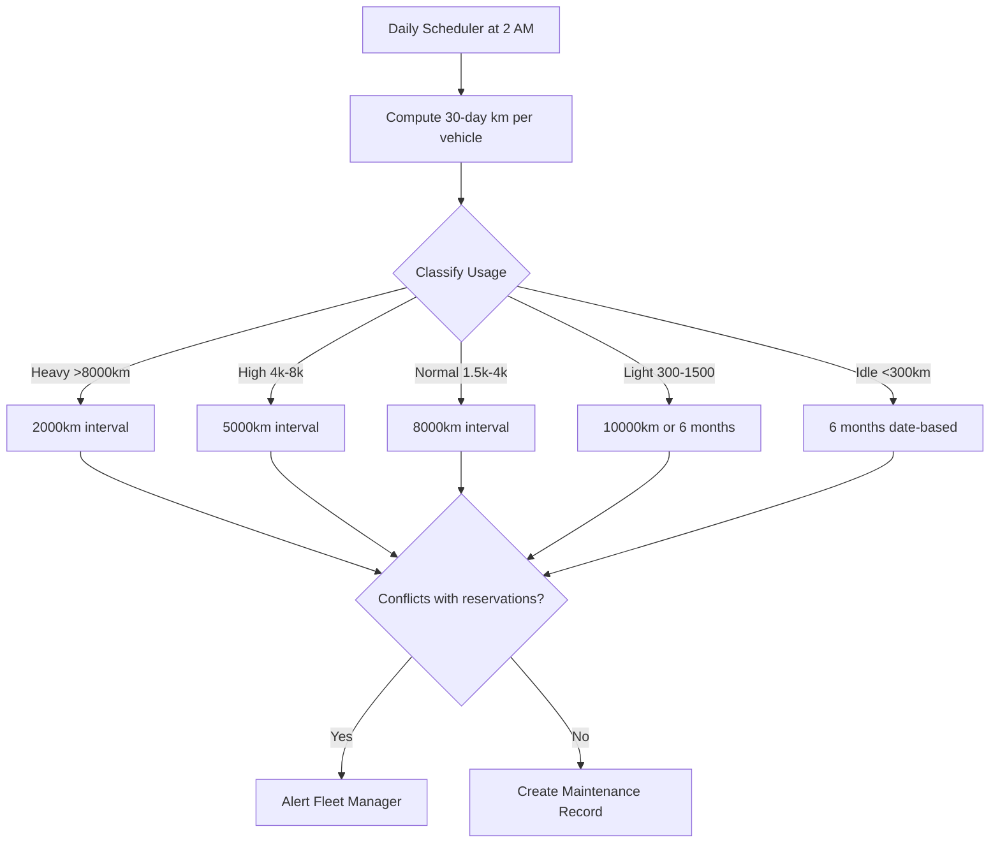

# Maintenance — Frappe: Functional Document

> **Product**: Asset Rental Platform — Vehicle Variant
> **Domain**: Maintenance Scheduling
> **Module**: `rental_vehicles` — Usage Profiling & Service Windows

---

## 1. Purpose & Scope

Defines the maintenance scheduling engine: usage-based and calendar-based triggers, reservation conflict detection, and service record creation. Entirely Desk-managed.

---

## 2. Business Requirements

| # | Requirement |
|---|---|
| VR-030 | **Maintenance hard-blocks reservations** — dates overlapping a Planned window are rejected with conflicting dates shown |
| VR-031 | **Maintenance should be planned ahead of time.** Retroactive entries overlapping confirmed reservations generate a conflict alert requiring Fleet Manager resolution. |
| VR-032 | Three trigger engines: high-usage (mileage), low-usage (idle-time), manual |
| VR-033 | Daily usage profiling: Idle, Light, Normal, High, Heavy — each class has a different service interval |
| VR-034 | A maintenance window has start date, end date, and estimated duration |
| VR-035 | Completed maintenance creates a service record with technician, cost, and parts |
| VR-036 | If planned maintenance overlaps an existing confirmed reservation, Fleet Manager is notified to resolve |

---

## 3. Workflow

---

## 4. Business Rules

1. Usage profiling runs at **2 AM** off-hours. Query indexed on `(vehicle, reading_date)`.
2. Maintenance-blocked dates are merged into unavailability — customers see "unavailable" with no reason.
