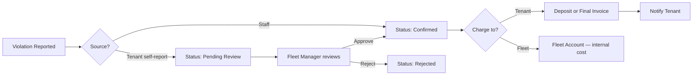

# Traffic Violations — Frappe: Functional Document

> **Product**: Asset Rental Platform — Vehicle Variant
> **Domain**: Traffic Violations
> **Module**: `rental_vehicles` — Reporting, Charging & Approval

---

## 1. Purpose & Scope

Defines the violation lifecycle: reporting (staff or tenant self-report), approval gate, charging (tenant deposit/invoice or fleet account), post-settlement handling, and notification.

---

## 2. Business Requirements

| # | Requirement |
|---|---|
| VR-050 | Traffic violations (speeding, parking, signal, other) must be linkable to a vehicle and agreement |
| VR-051 | Each violation must record: date, type, authority, fine amount, and evidence document |
| VR-052 | Violations must be chargeable to either the tenant (deposit/final invoice) or the fleet account |
| VR-053 | The tenant must be notified of any violation charged to them |

---

## 3. Workflow

---

## 4. Business Rules

1. Violations linked to the agreement in force at the time of the violation.
2. **Self-reported violations** default to `Pending Review`. Fleet Manager must set `Confirmed` before charging.
3. **Rate limiting**: 5 self-report submissions/hour per authenticated user.
4. **Post-settlement violations**: Create a standalone Sales Invoice to the ex-tenant if the deposit is already refunded.
5. **Guarantor visibility**: Guarantors do NOT see violation data.
