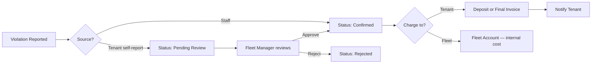

# Domain V06 — Traffic Violations: Implementation Plan

> **Variant**: Vehicles (child app `rental_vehicles`)
> **Domain**: Traffic Violations
> **Sequence**: 6 of 7
> **Depends on**: V01 (custom fields, Vehicle DocType), Base D05 (Rental Agreement), Base D06 (deposit/invoice system), Base D07 (notification system)
> **Functional Refs**: [[frappe-functional|Frappe]] · [[web-functional|Web]] · [[flutter-functional|Flutter]]

---

## 1. Overview

Traffic violations (speeding tickets, parking fines, signal violations) are an unavoidable part of fleet operations. This domain handles the **entire violation lifecycle**: reporting (either by staff directly or by the tenant self-reporting through the app), an approval gate (self-reported violations require Fleet Manager confirmation before charging), financial charging (deducting from the tenant's deposit or adding to the final invoice, or absorbing into the fleet account), post-settlement handling (billing an ex-tenant after their deposit has been refunded), and notification to the affected tenant.

The domain introduces a **two-tier trust model**: violations reported directly by staff (Rental Agent or Fleet Manager) are immediately `Confirmed` and can be charged. Violations self-reported by tenants through the Flutter app go to `Pending Review` — the Fleet Manager must verify and approve before any financial action. This prevents fraud while enabling responsible self-reporting.

---

## 2. Frappe — Traffic Violation DocType

### 2.1 `Traffic Violation` Schema

> **Requires**: V01-2.1 (app scaffold), Base D05-2.1 (Rental Agreement)

The **Traffic Violation** DocType is the central record for a single traffic offence. In fleet rental, traffic violations are a daily reality — speed cameras, parking wardens, and traffic police issue fines against the vehicle's plate number, and the rental company receives the ticket. The company then needs to: (1) identify which tenant was driving at the time, (2) decide who pays (the tenant or the company), and (3) process the charge.

Each violation is linked to both a **vehicle** (the physical car that was cited) and the **agreement** that was active at the time of the violation. This dual link is critical because a single vehicle may have multiple tenants over time — the system needs to charge the correct person. The `violation_date` determines which agreement was active (the system matches it against agreement date ranges).

The `charge_to` field is a business decision: most violations are charged to the tenant ("you were driving, you pay the fine"), but some are absorbed by the fleet account (e.g., a company vehicle used for company business, or a violation caused by a vehicle defect like broken taillights). The `reported_by` field distinguishes staff-reported violations (which skip the approval gate) from tenant self-reports (which require Fleet Manager review).

| Field | Type | Notes |
|---|---|---|
| `vehicle` | Link → Rental Asset | The vehicle cited |
| `agreement` | Link → Rental Agreement | The agreement active at violation time |
| `violation_date` | Date | When the violation occurred |
| `violation_type` | Select | `Speeding`, `Parking`, `Signal`, `Other` |
| `authority` | Data | e.g., "Dubai Police", "Abu Dhabi Traffic" |
| `fine_amount` | Currency | Amount of the fine |
| `charge_to` | Select | `Tenant`, `Fleet Account` |
| `status` | Select | `Pending Review`, `Confirmed`, `Rejected`, `Paid`, `Disputed` |
| `evidence_doc` | Attach | Photo/PDF of the violation notice |
| `reported_by` | Select | `Staff`, `Tenant Self-Report` |
| `reviewed_by` | Link → User | Fleet Manager who reviewed (for self-reports) |
| `review_notes` | Text | Justification for approval/rejection |

**Acceptance Criteria**:
- [ ] DocType created in Frappe Desk
- [ ] `violation_type` includes: `Speeding`, `Parking`, `Signal`, `Other`
- [ ] `charge_to` includes: `Tenant`, `Fleet Account`
- [ ] `status` transitions: `Pending Review` → `Confirmed` or `Rejected`; `Confirmed` → `Paid` or `Disputed`
- [ ] `reported_by` defaults to `Staff` for Desk entries, `Tenant Self-Report` for app submissions
- [ ] Fleet Manager has full CRUD; Rental Agent can create/read; Customer can only view their own
- [ ] `agreement` link must reference a valid agreement for the same vehicle

---

### 2.2 Violation Status Workflow

> **Requires**: 2.1

The violation status workflow implements a **trust hierarchy** based on who reported the violation. The fundamental question is: "Can we trust the reporter?" Staff members (Rental Agents and Fleet Managers) are trusted employees — if they say a violation occurred, it's treated as fact. Tenants, on the other hand, could theoretically fabricate violations to get ahead of charges or manipulate the timing of when a fine is processed.

**Staff-reported path**: When a Rental Agent or Fleet Manager creates a violation in Desk, the status is immediately set to `Confirmed`. No approval gate is needed. The Fleet Manager sets `charge_to` (Tenant or Fleet Account) and the system processes the charge. This is the path for: violations the company receives in the mail (speed camera tickets), violations flagged by the GPS speed alert system (V05), and violations discovered during vehicle return.

**Tenant self-reported path**: When a tenant reports a violation through the Flutter app ("I got a parking ticket on March 5"), the status is set to `Pending Review`. The Fleet Manager must then review the evidence, verify the violation is real (does the date match? does the location match where the vehicle was?), and either confirm or reject it. Self-reporting is valuable because some violations take weeks to reach the rental company — a tenant who reports immediately helps with cash flow planning.

Rejected violations get a `review_notes` explanation ("Violation date doesn't match rental period" or "No matching record from traffic authority") for transparency.

**Acceptance Criteria**:
- [ ] Staff-reported → immediate `Confirmed` status
- [ ] Tenant self-reported → `Pending Review` status
- [ ] Only Fleet Manager can transition from `Pending Review` to `Confirmed` or `Rejected`
- [ ] `Rejected` violations cannot be charged
- [ ] `Confirmed` with `charge_to = Tenant` → deposit deduction or invoice line item
- [ ] `Confirmed` with `charge_to = Fleet Account` → no tenant charge (internal cost)
- [ ] Status transitions logged for audit trail

---

### 2.3 Violation Charging Logic

> **Requires**: 2.2, Base D06-3.1 (deposit ledger), Base D06-4.1 (invoice system)

Once a violation is confirmed and charged to the tenant, the system needs to collect the money. This is complicated by **timing** — violations can arrive weeks or even months after they occur, and the tenant's agreement may have already ended and their deposit refunded.

**Scenario 1: Active agreement with sufficient deposit**: The most common case. The tenant still has an active rental, and their deposit covers the fine. The fine amount is deducted from the deposit balance (creating a `Deposit Deduction` entry in the deposit ledger from Base D06). The tenant sees the deduction in their portal/app.

**Scenario 2: Active agreement with insufficient deposit**: The tenant's deposit is partially depleted (perhaps from a previous violation or damage deduction). The remaining deposit balance is deducted, and the shortfall is added as a line item on the final Sales Invoice. Example: fine = 500 AED, deposit balance = 200 AED → deduct 200 from deposit + add 300 to invoice.

**Scenario 3: Post-settlement (agreement ended, deposit refunded)**: This is the tricky case. A speed camera ticket from January arrives in March, but the tenant's 3-month rental ended in February and their deposit was refunded. The system creates a **standalone Sales Invoice** and sends it to the ex-tenant with a description explaining the charge. This invoice is not linked to the original agreement's subscription — it's a one-off collection.

The charging logic must be **idempotent**: if a violation is already in `Paid` status, attempting to charge it again is a no-op. This prevents accidental double-charging from retry logic or UI bugs.

**Acceptance Criteria**:
- [ ] Active agreement + sufficient deposit → fine deducted from deposit
- [ ] Active agreement + insufficient deposit → partial deposit deduction + invoice remainder
- [ ] Agreement settled, deposit refunded → standalone Sales Invoice created
- [ ] Invoice includes: violation type, date, authority, fine amount
- [ ] `charge_to = Fleet Account` → no deposit deduction, no invoice
- [ ] Violation status set to `Paid` after successful charge processing
- [ ] Double-charging prevented (idempotent: charging a `Paid` violation → no-op)

---

## 3. Frappe — Violation API Endpoints

### 3.1 `report_traffic_violation` API

> **Requires**: 2.1

The **primary API endpoint** for reporting traffic violations — used by both Desk (staff) and Flutter (tenant self-report). The endpoint creates a `Traffic Violation` record with the provided details and automatically sets the `status` and `reported_by` fields based on the caller's role.

When a **staff member** calls this API (detected by checking if the user has `Rental Agent` or `Fleet Manager` role), the violation is created with `status = Confirmed` and `reported_by = Staff`. The violation can be charged immediately.

When a **customer** calls this API (detected by checking if the user has `Customer` role), the violation is created with `status = Pending Review` and `reported_by = Tenant Self-Report`. The violation goes into the approval queue for Fleet Manager review.

**Rate limiting**: Tenant self-reports are capped at **5 submissions per hour** per authenticated user. This prevents abuse scenarios like: a tenant mass-submitting fake violations to overwhelm the Fleet Manager's review queue, or a script automating violation creation. The 6th submission within a rolling hour window returns HTTP 429 "Too Many Requests" with a user-friendly error.

The `evidence_doc` field is optional at creation time — the tenant can report the violation immediately and upload the ticket photo later.

**Acceptance Criteria**:
- [ ] Creates a Traffic Violation record
- [ ] Staff caller → `status = Confirmed`, `reported_by = Staff`
- [ ] Customer caller → `status = Pending Review`, `reported_by = Tenant Self-Report`
- [ ] Rate limit: 6th submission within an hour → HTTP 429 "Too Many Requests"
- [ ] `evidence_doc` is optional (can be uploaded later)
- [ ] `agreement` must be a valid agreement linked to the authenticated user (customer) or any agreement (staff)
- [ ] Returns the created violation's name

---

### 3.2 `get_violation_history` API

> **Requires**: 2.1

This API powers the **violation history views** on both the Flutter app and the web portal. When a customer wants to see all violations associated with their rental, or when the Fleet Manager wants to review a tenant's violation history, this endpoint returns the complete list.

The response includes all key fields for each violation: type (Speeding/Parking/Signal/Other), date, issuing authority, fine amount, `charge_to` (Tenant/Fleet Account), and the current status with its associated badge color. For Fleet Manager and Accountant callers, the evidence documents (photos/PDFs of the ticket) are also accessible. For customers, evidence documents are NOT included in the response — this prevents disputes over evidence handling.

The list is sorted by `violation_date` descending (newest first) so the most recent violation is always at the top. Guarantors are explicitly blocked from accessing violation data — violation history is between the tenant and the rental company only.

**Acceptance Criteria**:
- [ ] Returns all violations for the specified agreement
- [ ] Each entry includes: type, date, authority, fine amount, status, charge_to
- [ ] Sorted by `violation_date` descending (newest first)
- [ ] Customer can only see their own violations
- [ ] Guarantors CANNOT access violation data
- [ ] Evidence documents: accessible to Fleet Manager and Accountant only (not customers)

---

## 4. Web — Violation Portal Integration

### 4.1 Agreement Detail — Violation Charges

> **Requires**: Base D06 (accounting portal), 2.3 (charging logic)

Violation charges appear as **line items** on the agreement detail in the `/my-rentals` web portal. This is largely handled by the base accounting system (Base D06) — when a deposit deduction or invoice line item is created by the charging logic (2.3), it automatically appears in the portal's financial summary.

The only V06-specific work here is ensuring the line item description is clear and informative: "Traffic Violation — Speeding — 2025-01-15 — Dubai Police" (not a generic "Violation charge"). This gives the customer enough context to understand the charge without needing to contact support.

Evidence documents (photos of the ticket) are NOT accessible to customers on the web portal — they can only be viewed by Fleet Manager and Accountant roles. There is no self-report form on the web portal; self-reporting is a mobile-only feature (Flutter app).

**Acceptance Criteria**:
- [ ] Violation charges visible as line items on agreement detail
- [ ] Each line shows: description ("Traffic Violation — Speeding — 2025-01-15"), amount
- [ ] Evidence documents NOT accessible to customers on the web portal
- [ ] No self-report form on web (self-report is app-only)

---

## 5. Flutter — Violation Reporting & History

### 5.1 Traffic Violation Report Screen

> **Requires**: 3.1 (report API), Base D01-8.3 (screen stubs)

The **self-report screen** in the Flutter app lets tenants proactively report traffic violations they've received. This is valuable for the rental company because some violations (especially parking tickets) take weeks to be processed by the traffic authority and delivered to the vehicle owner. A tenant who reports immediately helps the company plan for the charge.

The form collects 4 fields: **violation type** (dropdown: Speeding, Parking, Signal, Other), **fine amount** (currency input with the tenant's best estimate — the Fleet Manager can adjust during review), **violation date** (date picker, restricted to dates within the tenant's rental period), and **issuing authority** (free text, e.g., "Dubai Police", "Sharjah Municipality").

The **evidence upload** is the most technically complex part of this screen. Photos captured from the camera or selected from the gallery must be **compressed to ≤2MB** before upload (using the `flutter_image_compress` package) to prevent upload timeouts on slow mobile connections. PDF uploads (for digital tickets) are accepted without compression. The upload shows a **progress indicator** (percentage bar), and if the upload fails (network timeout, server error), a **retry button** is shown instead of silently failing.

After successful submission, the user is navigated to the violation history screen with a confirmation snackbar: "Violation reported. Pending review by fleet manager."

If the rate limit is exceeded (6th submission in an hour), the error message is user-friendly: "You've submitted several reports recently. Please try again in an hour."

**Acceptance Criteria**:
- [ ] Form fields: violation type (dropdown), fine amount (currency input), date (date picker), authority (text input)
- [ ] Evidence upload: camera or gallery photo, or PDF from files
- [ ] Photos compressed to ≤2MB before upload
- [ ] Upload shows progress indicator
- [ ] Upload failure → retry button
- [ ] Submission → API call to `report_traffic_violation`
- [ ] Success → navigate to violation history with confirmation message
- [ ] Rate limit exceeded → user-friendly error: "Please try again later"

---

### 5.2 Traffic Violation History Screen

> **Requires**: 3.2 (violation history API)

The **violation history screen** gives the tenant a complete view of all violations associated with their rentals — past and present. This is important for transparency: the tenant can see not just the violations charged to them, but also violations that were rejected (so they know their self-report was reviewed), violations charged to the fleet account (so they're not confused by charges that don't appear on their invoice), and the current status of pending reviews.

Each violation entry in the list shows: violation type ("Speeding"), date ("March 5, 2025"), fine amount ("500 AED"), charge status ("Charged to Tenant" or "Fleet Account"), and a **status badge** with intuitive color coding:

| Status | Badge Color | Meaning |
|---|---|---|
| `Pending Review` | Yellow/Amber | Self-report awaiting Fleet Manager review |
| `Confirmed` | Orange | Verified, charge will be processed |
| `Rejected` | Grey | Self-report was reviewed and dismissed |
| `Paid` | Green | Charge processed, fine deducted/invoiced |
| `Disputed` | Red | Tenant is contesting the violation |

Tapping a violation opens a **detail view** showing: all fields, review notes (if reviewed), and evidence document (if uploaded and accessible). The list supports **pull-to-refresh** to reload after a Fleet Manager reviews a pending violation.

The Guarantor role cannot access this screen — violation history is private to the tenant.

**Acceptance Criteria**:
- [ ] Lists all violations for the tenant across all agreements
- [ ] Each entry shows: type, date, fine amount, charge_to, status badge
- [ ] Status badges color-coded per the table above
- [ ] Sorted by violation date descending
- [ ] Tapping a violation shows detail (type, date, authority, amount, status, evidence if available)
- [ ] Guarantor role does NOT see violation data
- [ ] Pull-to-refresh reloads the list

---

## 6. Cross-Cutting Concerns

### 6.1 Logging

All critical decision points in this domain must emit structured log entries for auditability and debugging:

| Location | Log Level | What to Log |
|---|---|---|
| `report_traffic_violation` API (Staff) | `INFO` | Agreement name, vehicle name, violation type, fine amount, reported by user |
| `report_traffic_violation` API (Tenant) | `INFO` | Agreement name, vehicle name, violation type, fine amount, self-reported by user |
| Rate limit trigger (6th submission) | `WARNING` | User email, submission count in rolling hour, IP address |
| Violation status transition | `INFO` | Violation name, old status → new status, transitioned by user, review notes if applicable |
| Violation confirmation (Fleet Manager) | `INFO` | Violation name, confirmed by user, charge_to decision |
| Violation rejection (Fleet Manager) | `INFO` | Violation name, rejected by user, review notes |
| Deposit deduction (Scenario 1: full coverage) | `INFO` | Violation name, agreement name, fine amount, deposit deduction amount |
| Deposit deduction (Scenario 2: partial) | `INFO` | Violation name, agreement name, fine amount, deposit portion, invoice remainder |
| Post-settlement invoice (Scenario 3) | `WARNING` | Violation name, ex-tenant email, standalone invoice name, fine amount |
| `get_violation_history` API | `INFO` | Agreement name, caller role, violation count returned, execution time |
| Evidence document access attempt | `INFO` | Violation name, caller role, access granted/denied |

**Acceptance Criteria**:
- [ ] All violation status transitions logged with full context (who, when, why)
- [ ] Financial charging operations logged at `INFO` with deposit/invoice breakdown
- [ ] Post-settlement invoicing logged at `WARNING` (unusual event requiring attention)
- [ ] Rate limit triggers logged at `WARNING` with user and IP context
- [ ] Structured logging uses `frappe.logger()` with the `rental_vehicles` namespace
- [ ] No sensitive evidence document content in logs (only document names/references)

---

### 6.2 Caching

| Data | Cache Key Pattern | TTL | Invalidation Trigger |
|---|---|---|---|
| Violation history (per agreement) | `violation_history:{agreement_name}` | 10 min | Traffic Violation create/update |
| Violation count (for rate limiting) | `violation_rate:{user_email}` | 60 min (rolling window) | New violation submission |
| Active agreement lookup (for charge routing) | `active_agreement:{vehicle_name}` | 5 min | Rental Agreement status change |

**Implementation**: Use Frappe's `frappe.cache()` (Redis-backed). The rate limiting counter uses Redis `INCR` with TTL for efficient rolling window tracking.

**Acceptance Criteria**:
- [ ] Violation history cached per agreement with moderate TTL
- [ ] Rate limiting counter uses Redis atomic increment (not DB queries)
- [ ] Cache invalidated when violations are created or status changes
- [ ] Active agreement cache invalidated on agreement status transitions

---

### 6.3 Rate Limiting

| Endpoint | Limit | Scope | Response on Limit |
|---|---|---|---|
| `report_traffic_violation` (Tenant self-report) | 5 req/hour | Per authenticated user | HTTP 429 with user-friendly error message |
| `report_traffic_violation` (Staff) | 60 req/min | Per user session | HTTP 429 with `Retry-After` header |
| `get_violation_history` API | 30 req/min | Per user | HTTP 429 with `Retry-After` header |

**Implementation**: Tenant self-report rate limit is intentionally aggressive (5/hour) to prevent abuse. Staff rate limit is standard. The rate limit check for tenant self-reports uses Redis-backed counter (see 6.2).

**Acceptance Criteria**:
- [ ] Tenant self-report limited to 5 per hour per user
- [ ] 6th submission within an hour returns HTTP 429 with message: "You've submitted several reports recently. Please try again in an hour."
- [ ] Staff submissions have a higher limit (60/min)
- [ ] Rate limit logging at `WARNING` when limit is triggered

---

### 6.4 Security Validation

| Check | Location | Rule |
|---|---|---|
| Role-based status assignment | `report_traffic_violation` API | Staff → `Confirmed`; Customer → `Pending Review` (based on session user role) |
| Approval gate role enforcement | Status transition | Only Fleet Manager can transition `Pending Review` → `Confirmed` or `Rejected` |
| Agreement ownership validation | `report_traffic_violation` (Customer) | Customer can only report violations against their own agreements |
| Guarantor exclusion | `get_violation_history` | Guarantors explicitly blocked from accessing violation data |
| Evidence document access control | `get_violation_history` | Evidence documents only accessible to Fleet Manager and Accountant (NOT customers) |
| Charge idempotency | Charging logic | `Paid` status violations cannot be charged again (idempotent processing) |
| Post-settlement invoice guard | Charging logic (Scenario 3) | Standalone invoices require validation that original agreement is settled and deposit refunded |
| Violation-agreement date matching | `Traffic Violation` validation | `violation_date` must fall within the linked agreement's date range |
| Fine amount validation | `Traffic Violation` validation | `fine_amount` must be positive (reject negative or zero values) |
| Review notes requirement | Rejection workflow | `Rejected` violations require non-empty `review_notes` (transparency) |

**Acceptance Criteria**:
- [ ] Customer self-reports always start at `Pending Review` (cannot self-confirm)
- [ ] Only Fleet Manager can approve/reject pending violations
- [ ] Customers can only report violations on their own agreements
- [ ] Evidence documents blocked for Customer role (only Fleet Manager + Accountant)
- [ ] Guarantors receive HTTP 403 on violation endpoints
- [ ] Double-charging prevented (idempotent charging logic)
- [ ] Violation date validated against agreement date range
- [ ] Rejection requires review notes

---

## 7. Domain-Level Acceptance Criteria

- [ ] Staff-reported violations are immediately Confirmed
- [ ] Self-reported violations go to Pending Review
- [ ] Fleet Manager can confirm or reject self-reported violations
- [ ] Tenant-charged violations are deducted from deposit or added to invoice
- [ ] Post-settlement violations generate standalone Sales Invoices
- [ ] Self-report rate-limited to 5/hour per user
- [ ] Guarantors cannot see violation data
- [ ] Evidence documents only accessible to Fleet Manager and Accountant

---

## 8. Estimated Effort

| Layer | Effort |
|---|---|
| Frappe (Traffic Violation DocType + workflow + charging logic + APIs) | 4 days |
| Web (violation charges on agreement — handled by base accounting) | 0.5 days |
| Flutter (report screen + history screen + evidence upload) | 3 days |
| **Total** | **7.5 days** |
