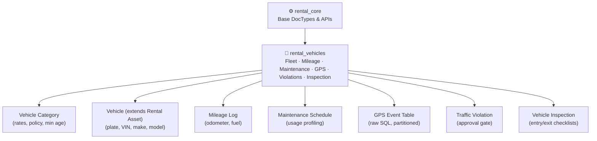
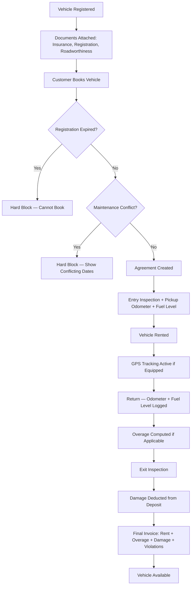
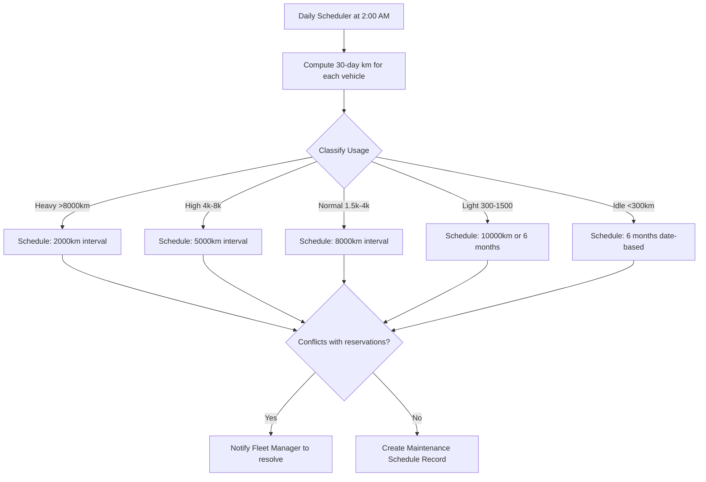
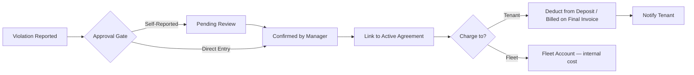
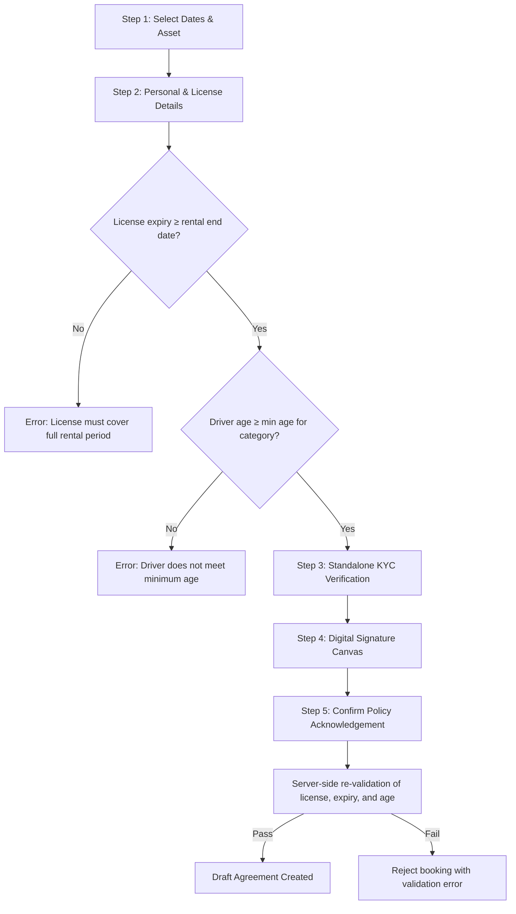

# Vehicles — Variant Overview

> **Product**: Asset Rental Platform — Vehicle Variant
> **App**: `rental_vehicles` (extends `rental_core`)
> **Purpose**: Architecture summary, Core DocTypes, Feature Map, Personas, User Stories, and Key Workflows.

---

## 1. What This Variant Adds

`rental_vehicles` extends the base platform with everything unique to fleet vehicle rental. It does **not** duplicate agreement, billing, deposit, or notification logic — those are inherited from `rental_core`.

---

## 2. Architecture

---

## 3. Core DocTypes & Schema Additions

| DocType | Purpose | Key Fields |
|---|---|---|
| `Vehicle Category` | Configures category-specific rates, policies, and limits | rates (daily/weekly/monthly), included km/day, overage rate/km, fuel policy, min age, required license class |
| `Vehicle` (extends `Rental Asset`) | Represents a specific fleet vehicle asset | plate number, VIN, make, model, year, transmission, seat count, current mileage, linked GPS device ID |
| `Mileage Log` | Logs vehicle odometer and fuel levels at key lifecycle events | agreement_id, odometer reading, fuel level (0-100%), log type (`Pickup` / `Return` / `Mid-Term`) |
| `Maintenance Schedule` | Pre-planned maintenance windows that block bookings | vehicle_id, start_date, end_date, estimated_duration, trigger type (`Usage` / `Time` / `Manual`), technician details |
| `GPS Event` (Raw SQL) | High-performance partitioned table for raw telematics data | device_id, latitude, longitude, speed, timestamp |
| `Traffic Violation` | Holds traffic fines linked to vehicle and agreement | agreement_id, violation_type, fine_amount, authority, evidence document, status (`Pending Review` / `Confirmed`), charge status (`Tenant` / `Fleet`) |
| `Vehicle Inspection` | Captures checklists and damage photos at pickup/return | agreement_id, type (`Entry` / `Exit`), checklist (exterior, interior, tyres, fluids), damage photos, estimated repair cost |

---

## 4. Feature Map

| Domain | Key Capabilities | Customer-Facing? |
|---|---|---|
| **Fleet & Vehicle Registry** | Categories with rates/policies, vehicle attributes (plate, VIN, make/model/year), driver requirements | ✅ Catalog + detail + license validation |
| **Insurance & Registration** | Document lifecycle, registration hard-block, insurance soft-alert, expiry alerts | ❌ Desk-only |
| **Mileage & Fuel** | Odometer at pickup/return, overage computation, fuel policy (≥90% = full), GPS mileage estimate | ✅ Read-only portal + app |
| **Maintenance** | Usage profiling (5 tiers), mileage/time triggers, reservation conflict detection, service records | ⚠️ Blocked calendar dates only |
| **GPS Telematics** | Live tracking, speed/geofence alerts, 90-day retention + daily aggregation, Socketio + polling | ⚠️ Fleet Manager live map only |
| **Traffic Violations** | Self-report (with approval gate), tenant/fleet charging, post-settlement invoicing | ✅ App self-report + history |
| **Vehicle Inspection** | Entry/exit checklists, photo evidence, damage → deposit deduction | ⚠️ Exit deductions only |

---

## 5. Vehicle-Specific Personas

| Persona | Role | What They Do Here | Touchpoint |
|---|---|---|---|
| 🚗 **Fleet Manager** | Fleet Operations Lead | Manages fleet, schedules maintenance, monitors GPS, handles violations, receives document expiry alerts | Frappe Desk |
| 🤝 **Rental Agent** | Customer Service / Sales | Logs odometer/fuel at pickup/return, performs entry/exit inspections, sets up agreements | Frappe Desk |
| 🏎️ **Driver Tenant** | Customer | Browses catalog, validates license, tracks mileage, self-reports violations, pays invoices | Web Portal / Flutter App |
| 💼 **Company Fleet** | Corporate Tenant | Rents multiple vehicles for company use (v1: single named driver per agreement, trade license KYC verification) | Web Portal / Flutter App |

---

## 6. User Stories (Summary)

| ID | Persona | Story | Domain |
|---|---|---|---|
| VS-001 | Fleet Manager | See all vehicles with expired or near-expiry documents | Insurance & Registration |
| VS-002 | Fleet Manager | Schedule a maintenance window in advance | Maintenance |
| VS-003 | Rental Agent | Log the odometer and fuel levels at pickup and return | Mileage & Fuel |
| VS-004 | System | Block reservations that conflict with maintenance | Maintenance |
| VS-005 | Fleet Manager | See live vehicle positions on a map | GPS Telematics |
| VS-006 | Customer | See that certain maintenance/booked dates are unavailable without disclosing the reason | Fleet & Vehicle Registry |
| VS-007 | Rental Agent | Report a traffic violation against an agreement | Traffic Violations |
| VS-008 | Fleet Manager | See a vehicle's usage profile auto-updated daily | Maintenance |
| VS-009 | Customer | Filter vehicles by category, transmission, seat count, and fuel type | Fleet & Vehicle Registry |
| VS-010 | Customer | Review my driven km, overage km, and overage charges in the portal | Mileage & Fuel |
| VS-011 | Customer | Input license details and date of birth in the booking flow | Fleet & Vehicle Registry |
| VS-012 | Customer | Self-report a traffic violation and upload photo evidence from the app | Traffic Violations |

---

## 7. Key Workflows

### 7.1 Vehicle Rental Lifecycle

### 7.2 Maintenance Scheduling Engine

### 7.3 Violation Workflow

### 7.4 Booking with License & Age Validation

---

## 8. Key Business & Integration Rules

1. **Registration Block**: Vehicles with an expired registration cannot be booked or rented.
2. **Insurance Warning**: Expired insurance triggers warnings that require Fleet Manager override.
3. **Maintenance Gating**: Planned maintenance blocks reservation calendars dynamically.
4. **Overage Calculation**: Overage km = `max(0, returned_odometer - pickup_odometer - (included_km_day * rental_days))`. Charges are added directly to the final Invoice.
5. **Fuel Tolerance**: Full fuel is defined as ≥90%. Under-fuel returns trigger automated deficit charges.
6. **Telemetry Storage**: Raw GPS events bypass the Frappe ORM and write directly to partitioned SQL tables with a 90-day pruning rule.
7. **B2B Limit**: Corporate rentals are limited to a single named driver per active agreement in version 1.
8. **Violation Self-Reporting**: Violations reported by tenants in the app go to `Pending Review` status before confirmation. Post-settlement violations generate a standalone Sales Invoice to the ex-tenant.
9. **Live Map Gate**: Real-time position tracking is only accessible to the `Fleet Manager` role.
10. **License Match**: The customer's driver's license expiration must cover the entirety of the rental agreement.

---

## 9. Domain Documentation Index

| # | Domain | Docs |
|---|---|---|
| 01 | [[01 - Fleet & Vehicle Registry/frappe-functional\|Fleet & Vehicle Registry]] | Frappe · Web · Flutter |
| 02 | [[02 - Insurance & Registration/frappe-functional\|Insurance & Registration]] | Frappe · Web · Flutter |
| 03 | [[03 - Mileage & Fuel/frappe-functional\|Mileage & Fuel]] | Frappe · Web · Flutter |
| 04 | [[04 - Maintenance/frappe-functional\|Maintenance]] | Frappe · Web · Flutter |
| 05 | [[05 - GPS Telematics/frappe-functional\|GPS Telematics]] | Frappe · Web · Flutter |
| 06 | [[06 - Traffic Violations/frappe-functional\|Traffic Violations]] | Frappe · Web · Flutter |
| 07 | [[07 - Vehicle Inspection/frappe-functional\|Vehicle Inspection]] | Frappe · Web · Flutter |

---

## 10. Related

- [[Vehicles MOC|🧱 Vehicles MOC]]
- [[../Base/Base Overview|🏗️ Base Platform Overview]]
- [[../Asset Rental MOC|🏢 Asset Rental MOC]]
