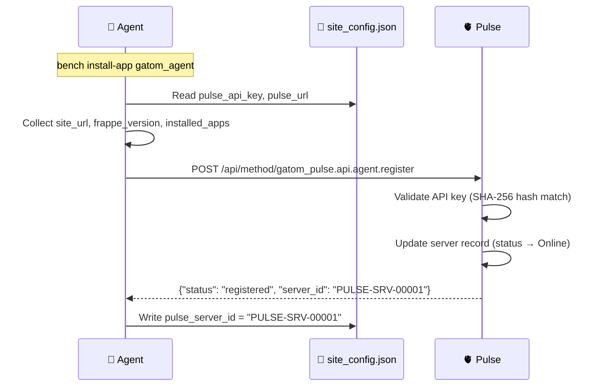

# A01 — Server Registration: Functional Analysis

> **Component**: `gatom_agent`
> **Domain**: A01 — Server Registration
> **Pulse Counterpart**: [[functional|P01 — Client & Server Registry]]
> **File**: `collectors/heartbeat.py` (registration shares the heartbeat module)
> **Audience**: Gatom developers

---

## 1. Purpose & Scope

When `gatom_agent` is installed on a client server, it must **register itself** with Pulse so that Pulse knows this server exists and can start tracking it. Registration is the very first communication between agent and Pulse — it happens once on install and can be re-triggered on every startup.

---

## 2. Business Requirements

| # | Requirement |
|---|---|
| A01-001 | On first install, agent must call Pulse's registration endpoint to announce itself |
| A01-002 | Agent must send: site URL, Frappe version, list of installed apps, agent version |
| A01-003 | Agent must store the returned `server_id` in `site_config.json` for future requests |
| A01-004 | On every startup (bench restart), agent must re-register to update version info |
| A01-005 | If Pulse is unreachable at install time, registration must retry on next startup |

---

## 3. Registration Flow



---

## 4. Request Payload

```
POST /api/method/gatom_pulse.api.agent.register
Authorization: Bearer {pulse_api_key}
X-Agent-Version: 1.0.0
X-Request-Timestamp: 1749720000
X-Request-ID: 550e8400-e29b-41d4-a716-446655440000
Content-Type: application/json

{
    "site_url": "https://rental.alandalus.com",
    "frappe_version": "15.42.0",
    "python_version": "3.12.4",
    "os_version": "Ubuntu 22.04.4 LTS",
    "installed_apps": ["frappe", "erpnext", "rental_core", "rental_flats", "gatom_agent"],
    "agent_version": "1.0.0",
    "timezone": "Asia/Riyadh"
}
```

> ⚠️ **Canonical payload**: [[../../API Contract#2.1 Register Server|API Contract §2.1]]

---

## 5. Response Handling

| Pulse Response | Agent Action |
|---|---|
| `200` — registered | Store `server_id` in `site_config.json`. Log INFO. |
| `401` — invalid API key | Log CRITICAL: "API key rejected. Check pulse_api_key in site_config." Disable agent. |
| `426` — version too old | Log CRITICAL: "Agent version below minimum. Upgrade required." Continue sending heartbeats. |
| `5xx` / timeout | Log WARNING: "Pulse unreachable during registration. Will retry on next startup." |

---

## 6. Implementation

```python
def register_server():
    """Called on after_install hook and on every bench restart."""
    config = get_pulse_config()
    
    if not config.pulse_api_key or not config.pulse_url:
        frappe.logger().warning("gatom_agent: pulse_api_key or pulse_url not configured")
        return
    
    payload = {
        "site_url": frappe.utils.get_url(),
        "frappe_version": frappe.__version__,
        "python_version": platform.python_version(),
        "os_version": get_os_version(),
        "installed_apps": frappe.get_installed_apps(),
        "agent_version": __version__,
        "timezone": frappe.utils.get_time_zone()
    }
    
    response = pulse_client.post("register", payload)
    
    if response.status_code == 200:
        server_id = response.json().get("server_id")
        if server_id:
            frappe.conf.pulse_server_id = server_id
            update_site_config("pulse_server_id", server_id)
        frappe.logger().info(f"gatom_agent: Registered with Pulse as {server_id}")
    elif response.status_code == 401:
        frappe.logger().error("gatom_agent: API key rejected by Pulse")
        update_site_config("pulse_agent_disabled", True)
```

---

## 7. Acceptance Criteria

- [ ] On `bench install-app gatom_agent`, registration is called automatically
- [ ] On `bench restart`, registration is called on first scheduler tick
- [ ] Valid API key → server registered, `pulse_server_id` stored
- [ ] Invalid API key → agent disabled, CRITICAL log message
- [ ] Pulse unreachable → no crash, retries on next startup
- [ ] Re-registration updates version fields without creating duplicate records
- [ ] `pulse_server_id` is set only if Pulse returns it (not a default value)

---

## 🔗 Related

- [[../Agent Overview|🤖 Agent Overview]]
- [[functional|P01 — Client & Server Registry (Pulse side)]]
- [[../P00 - Configuration/agent-functional|A08 — Transport & Resilience]]
