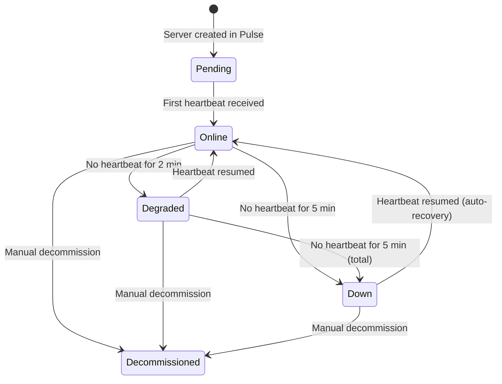

# P02 — Server Health Monitoring: Functional Analysis

> **Product**: Gatom Pulse
> **Domain**: P02 — Server Health Monitoring
> **Module**: `gatom_pulse`
> **Audience**: Gatom developers, operations staff

---

## 1. Purpose & Scope

This domain ensures Gatom knows within 60 seconds if any client server is experiencing issues. The `gatom_agent` on each client server collects system health metrics and pushes them to Pulse via HTTP POST every 60 seconds. Pulse evaluates thresholds, manages a server status state machine, and triggers alerts (P05) and tickets (P06) when problems are detected.

---

## 2. Business Requirements

| # | Requirement |
|---|---|
| P02-001 | Agent must collect and push health metrics every 60 seconds |
| P02-002 | Pulse must detect server silence (no heartbeat) within 2 minutes → `Degraded` |
| P02-003 | Server silent for > 5 minutes → `Down` status + auto-create incident ticket |
| P02-004 | Resource thresholds must be configurable per server (with sensible defaults) |
| P02-005 | Heartbeat data must be stored in Redis for real-time state (not MariaDB) |
| P02-006 | Daily aggregated summaries (uptime %, avg CPU, avg RAM, avg disk) must be persisted to a DocType |
| P02-007 | Uptime history must be viewable for the last 90 days per server |
| P02-008 | When a `Down` server resumes heartbeats, status must auto-recover to `Online` and total downtime logged |

---

## 3. Heartbeat Payload

> ⚠️ **Canonical payload defined in**: [[../API Contract#2.2 Heartbeat|API Contract §2.2]]
> Domain docs must use the field names from the API Contract. Do not redefine payload fields here.

The agent collects the following system metrics on every heartbeat:

| Metric | Type | Collection Method |
|---|---|---|
| `cpu_pct` | float | `psutil.cpu_percent(interval=1)` |
| `ram_pct` | float | `psutil.virtual_memory().percent` |
| `ram_used_mb` / `ram_total_mb` | int | `psutil.virtual_memory()` |
| `disk_pct` | float | `psutil.disk_usage('/').percent` |
| `disk_used_gb` / `disk_total_gb` / `disk_free_gb` | float | `psutil.disk_usage('/')` |
| `load_avg_1m` | float | `os.getloadavg()[0]` (Linux only) |
| `mariadb_up` | bool | `frappe.db.sql("SELECT 1")` succeeds |
| `redis_up` | bool | `frappe.cache().ping()` succeeds |
| `rq_queue_depth` | int | `frappe.utils.background_jobs.get_queue_length()` |
| `rq_failed_jobs` | int | Count of failed jobs in RQ |
| `response_time_ms` | int | HTTP self-check response time |
| `http_status` | int | HTTP self-check status code |
| `active_workers` | int | Count active Gunicorn worker processes |

---

## 4. Server Status State Machine



| Transition | Trigger | Side Effects |
|---|---|---|
| `Pending` → `Online` | First heartbeat | Set `registered_at`, log event |
| `Online` → `Degraded` | 2 min silence | Log WARNING |
| `Online`/`Degraded` → `Down` | 5 min silence | Create Incident ticket (P06), send alert (P05), log CRITICAL |
| `Down` → `Online` | Heartbeat resumes | Auto-resolve Incident ticket, log total downtime, send recovery alert |
| Any → `Decommissioned` | Manual action | Soft-delete from active monitoring, agent decommission command via heartbeat (see [[../API Contract#7.6 Server Decommission via Heartbeat\|API Contract §7.6]]) |

> [!IMPORTANT]
> **Audit Requirement (LOG-02)**: Every status transition must create a Pulse Audit Log entry: `SERVER_STATUS_CHANGED`. The `details` JSON must include:
> ```json
> {
>     "old_status": "Online",
>     "new_status": "Down",
>     "trigger": "stale_heartbeat",
>     "last_seen_at": "2026-06-12T03:47:00Z",
>     "downtime_seconds": null
> }
> ```
> When transitioning from `Down` → `Online`, `downtime_seconds` must be populated with the total duration. This creates a queryable audit trail for SLA calculations (e.g., "show all downtime events for server X in the last 30 days").

---

## 5. Threshold Configuration

### 5.1 Default Thresholds (Pulse Configuration Singleton)

| Metric | Warning | Critical |
|---|---|---|
| CPU % | > 85% for 5 min | > 95% for 5 min |
| RAM % | > 85% | > 95% |
| Disk % | > 80% | > 90% |
| Queue depth | > 50 jobs | > 200 jobs |
| Response time | > 2000 ms | > 5000 ms |
| Redis | — | `ping = false` |
| MariaDB | — | `ping = false` |

### 5.2 Per-Server Overrides

Each `Pulse Server` can optionally override default thresholds via a child table `Server Threshold Override`:

| Field | Type |
|---|---|
| `metric` | Select: CPU, RAM, Disk, Queue, Response Time |
| `warning_value` | Float |
| `critical_value` | Float |

### 5.3 Sustained Tracking

Thresholds must be exceeded for `threshold_sustained_minutes` (default: 5) consecutive minutes before an alert is triggered. This prevents false alerts from transient spikes.

> ⚠️ **Full implementation spec**: [[../API Contract#7.3 Threshold Sustained Tracking|API Contract §7.3]]

- Redis counter per server per metric per level tracks consecutive breaches
- Counter increments on each heartbeat where threshold is exceeded
- Alert triggers when counter reaches `threshold_sustained_minutes`
- Counter resets when metric drops below threshold
- Each breach is logged in `Threshold Breach Log` with duration

---

## 6. API Endpoints

### 6.1 Receive Heartbeat (`allow_guest=True`)

```
POST /api/method/gatom_pulse.api.agent.heartbeat
Authorization: Bearer {api_key}
Body: { heartbeat payload above }
```

**Logic**:
1. Authenticate API key (SHA-256 hash lookup)
2. Store metrics in Redis: `pulse:heartbeat:{server_name}` → JSON with TTL 5 min
3. Update `Pulse Server.last_seen_at`
4. Evaluate thresholds → create `Pulse Alert` if breached (P05)
5. If server was `Degraded` or `Down` → transition to `Online` (recovery)
6. Return `{"status": "ok", "releases": [...]}` (piggyback release check)

**Acceptance Criteria**:
- [ ] Heartbeat processed in < 50ms (Redis write, no MariaDB write per heartbeat)
- [ ] `last_seen_at` updated on every heartbeat
- [ ] Threshold breach creates alert only on first breach (not every heartbeat)
- [ ] Recovery from `Down` → `Online` auto-resolves linked Incident ticket

---

## 7. Scheduler Jobs (Pulse-Side)

### 7.1 Stale Server Detector (`every 60 seconds`)

```python
def detect_stale_servers():
    """Check all non-Decommissioned servers for heartbeat staleness."""
    for server in get_active_servers():
        last_seen = redis.get(f"pulse:heartbeat:{server.name}")
        if not last_seen:
            elapsed = (now() - server.last_seen_at).total_seconds()
            if elapsed > 300 and server.status != "Down":
                transition_to_down(server)
            elif elapsed > 120 and server.status == "Online":
                transition_to_degraded(server)
```

### 7.2 Daily Uptime Aggregator (`daily at 1 AM`)

Computes and persists:
- Uptime % for previous day (minutes online / 1440)
- Average CPU, RAM, Disk from Redis time-series samples
- Stores as `Server Daily Summary` DocType

---

## 8. DocTypes

### 8.1 Server Daily Summary

| Field | Type | Notes |
|---|---|---|
| `server` | Link → Pulse Server | |
| `date` | Date | The day being summarized |
| `uptime_pct` | Float | 0.0 – 100.0 |
| `avg_cpu_pct` | Float | Average CPU for the day |
| `avg_ram_pct` | Float | Average RAM for the day |
| `avg_disk_pct` | Float | Average Disk for the day |
| `max_cpu_pct` | Float | Peak CPU for the day |
| `max_ram_pct` | Float | Peak RAM for the day |
| `avg_response_time_ms` | Int | Average HTTP self-check response time |
| `max_response_time_ms` | Int | Peak response time during the day |
| `avg_queue_depth` | Int | Average RQ queue depth |
| `max_queue_depth` | Int | Peak RQ queue depth |
| `total_downtime_minutes` | Int | Minutes server was in `Down` state |
| `incident_count` | Int | Number of incidents during the day |
| `threshold_breaches` | Int | Number of threshold breach events |

### 8.2 Threshold Breach Log

Records individual threshold breaches with duration tracking:

| Field | Type | Notes |
|---|---|---|
| `server` | Link → Pulse Server | |
| `metric` | Select | `CPU`, `RAM`, `Disk`, `Queue`, `Response Time`, `Redis`, `MariaDB` |
| `threshold_level` | Select | `Warning` / `Critical` |
| `threshold_value` | Float | The configured threshold |
| `actual_value` | Float | The measured value that breached |
| `started_at` | Datetime | When the breach was first detected |
| `ended_at` | Datetime | When the metric dropped below threshold |
| `duration_seconds` | Int | Total breach duration |
| `sustained` | Check | Whether breach lasted > `threshold_sustained_minutes` |
| `alert_created` | Check | Whether this breach triggered an alert |

---

## 9. Dashboard Views (React)

### 9.1 Fleet Overview Dashboard

- Server grid: cards with status dots (green/yellow/red/grey)
- Real-time: cards update via Frappe Socketio when heartbeat state changes
- Quick stats: total servers, servers online, servers degraded, servers down
- 30-day fleet uptime trend (sparkline chart)

### 9.2 Server Detail Page

- Live metrics: CPU gauge, RAM gauge, Disk bar, queue depth
- Uptime bar chart: last 30 days (green = 100%, yellow = degraded, red = downtime)
- Incident timeline: linked tickets with duration
- Threshold configuration panel

---

## 🔗 Related

- [[../Pulse Overview|🏗️ Pulse Overview]]
- [[../Pulse MOC|🫀 Pulse MOC]]
- [[agent-functional|🤖 A02 — Heartbeat Collection (Agent side)]]
