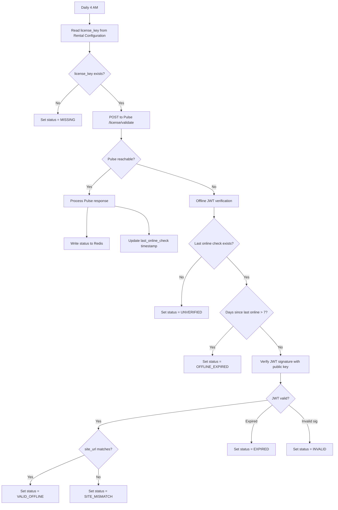

# A05 — License Validation: Functional Analysis

> **Component**: `gatom_agent`
> **Domain**: A05 — License Validation
> **Pulse Counterpart**: [[functional|P07 — Licensing Engine]]
> **File**: `collectors/license_checker.py`
> **Audience**: Gatom developers

---

## 1. Purpose & Scope

The agent validates the client's license daily, using a two-tier approach: **online validation** (calling Pulse API) with an **offline fallback** (local JWT signature verification). The result is stored in Redis so that `rental_core` can read it on every user login without making any network calls itself.

This is the critical bridge between Gatom's licensing system (Pulse P07) and the rental platform's license enforcement (Base Configuration D01).

---

## 2. Business Requirements

| # | Requirement |
|---|---|
| A05-001 | Agent must validate the license daily at 4 AM local time |
| A05-002 | Online validation must call Pulse API with the license JWT + current asset count |
| A05-003 | If Pulse is unreachable, agent must fall back to offline JWT signature verification |
| A05-004 | Offline mode is valid for 7 days (configurable via Pulse Configuration) |
| A05-005 | After 7 days offline, license status must be set to `OFFLINE_EXPIRED` |
| A05-006 | License status must be written to Redis key `pulse:license_status` for `rental_core` to read |
| A05-007 | Last successful online check timestamp must be stored for offline tolerance calculation |

---

## 3. License Status Values

The agent writes one of these values to `pulse:license_status`:

| Status | Meaning | `rental_core` Behavior |
|---|---|---|
| `VALID` | License valid (confirmed online) | Normal operation |
| `VALID_OFFLINE` | License valid (verified offline via JWT signature) | Normal operation |
| `EXPIRING` | License expires within 30 days | Warning banner |
| `GRACE` | License expired but within grace period | Red banner, grace mode |
| `EXPIRED` | License expired, past grace period | Redirect to `/suspended` |
| `REVOKED` | License explicitly revoked by Gatom | Redirect to `/suspended` |
| `OFFLINE_EXPIRED` | Offline for > 7 days | Redirect to `/suspended` |
| `ASSET_LIMIT` | Client exceeds licensed asset count | Warning banner |
| `MISSING` | No license key configured | Redirect to `/suspended` |
| `INVALID` | JWT signature verification failed | Redirect to `/suspended` |
| `SITE_MISMATCH` | JWT `site_url` doesn't match current site | Redirect to `/suspended` |
| `UNVERIFIED` | Never validated online — can't trust offline mode | Redirect to `/suspended` |

---

## 4. Validation Flow



---

## 5. Online Validation

### 5.1 Request

```
POST /api/method/gatom_pulse.api.agent.license_validate
Authorization: Bearer {pulse_api_key}
Content-Type: application/json

{
    "license_jwt": "eyJhbGciOiJSUzI1NiIs...",
    "server_id": "PULSE-SRV-00001",
    "asset_count": 127,
    "installed_apps": ["rental_core", "rental_flats"]
}
```

> [!WARNING]
> The HTTP payload field is `license_jwt` (not `license_key`). The agent reads `Rental Configuration.license_key` internally but maps it to `license_jwt` in the API payload. See [[../../API Contract#2.6 Validate License|API Contract §2.6]].

### 5.2 Pulse Response

```json
{
    "status": "VALID",
    "licensed_modules": ["rental_core", "rental_flats"],
    "max_assets": 500,
    "expires_at": "2027-01-15T00:00:00Z",
    "days_remaining": 217,
    "warnings": []
}
```

Possible `status` values from Pulse: `VALID`, `EXPIRING`, `GRACE`, `EXPIRED`, `REVOKED`, `ASSET_LIMIT`

---

## 6. Offline Validation

### 6.1 RSA Public Key

Embedded in the agent source code at `keys/gatom_license_public.pem`:

```python
PUBLIC_KEY = open(
    os.path.join(os.path.dirname(__file__), "..", "keys", "gatom_license_public.pem")
).read()
```

### 6.2 JWT Verification

```python
def offline_validate(license_key: str):
    last_online = cache.get("pulse:last_license_check")
    
    if not last_online:
        set_license_status("UNVERIFIED")
        return
    
    days_offline = (now_utc() - parse(last_online)).days
    if days_offline > OFFLINE_TOLERANCE_DAYS:
        set_license_status("OFFLINE_EXPIRED")
        return
    
    try:
        claims = jwt.decode(license_key, PUBLIC_KEY, algorithms=["RS256"],
                           options={"verify_exp": True})
        
        # Check site_url binding
        if claims.get("site_url"):
            current_site = frappe.utils.get_url()
            if claims["site_url"] not in current_site:
                set_license_status("SITE_MISMATCH")
                return
        
        set_license_status("VALID_OFFLINE")
        
    except jwt.ExpiredSignatureError:
        set_license_status("EXPIRED")
    except jwt.InvalidTokenError:
        set_license_status("INVALID")
```

---

## 7. Redis Interface

### 7.1 Keys Written

| Redis Key | TTL | Content |
|---|---|---|
| `pulse:license_status` | 48 hours | One of the status values from §3 |
| `pulse:last_license_check` | 8 days | ISO 8601 timestamp of last successful online check |

### 7.2 How `rental_core` Reads It

```python
# In rental_core — called on every login
status = frappe.cache().get("pulse:license_status")
# Returns "VALID", "GRACE", "EXPIRED", etc. or None if agent hasn't run yet
```

> [!NOTE]
> If status is `None` (agent never ran or Redis was flushed), `rental_core` allows login — this is the "fresh install grace" behavior.

---

## 8. Acceptance Criteria

- [ ] License validation runs daily at 4 AM local time
- [ ] Online validation sends license JWT + asset count + installed apps
- [ ] Successful online check → status written to Redis, timestamp updated
- [ ] Pulse unreachable → offline fallback triggered
- [ ] Offline fallback verifies JWT signature with embedded public key
- [ ] Never validated online → status = `UNVERIFIED` (no offline trust)
- [ ] Offline > 7 days → status = `OFFLINE_EXPIRED`
- [ ] Expired JWT → status = `EXPIRED`
- [ ] Invalid JWT signature → status = `INVALID`
- [ ] `site_url` mismatch → status = `SITE_MISMATCH`
- [ ] Redis key `pulse:license_status` has 48h TTL (auto-expires if agent stops)
- [ ] `rental_core` can read status without any network calls

---

## 🔗 Related

- [[../Agent Overview|🤖 Agent Overview]]
- [[functional|P07 — Licensing Engine (Pulse side)]]
- [[../P00 - Configuration/agent-functional|A08 — Transport & Resilience]]
