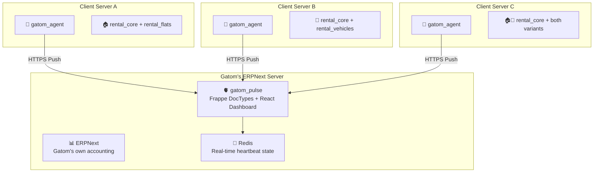
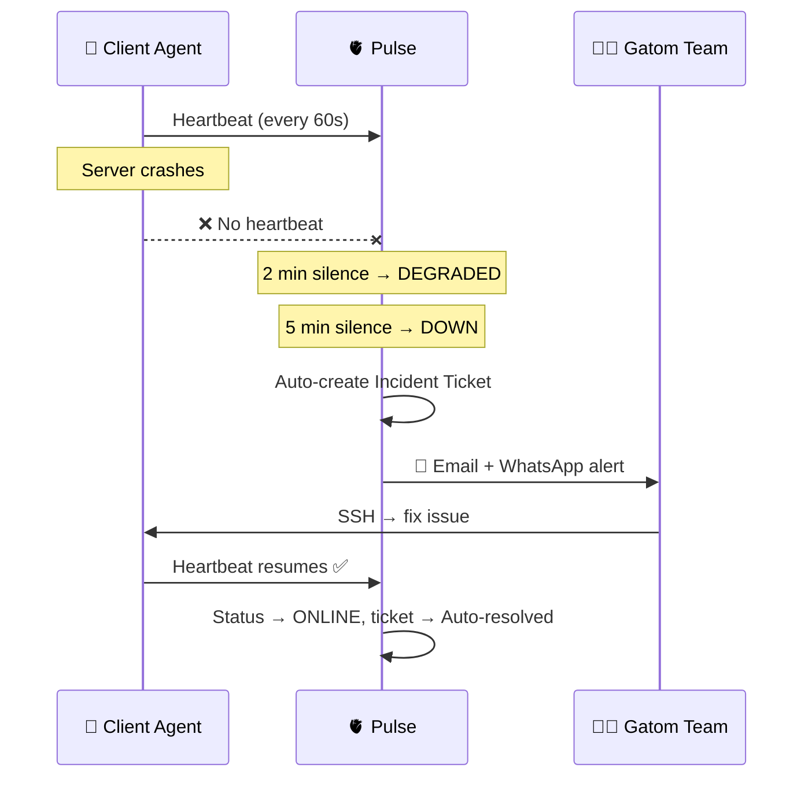
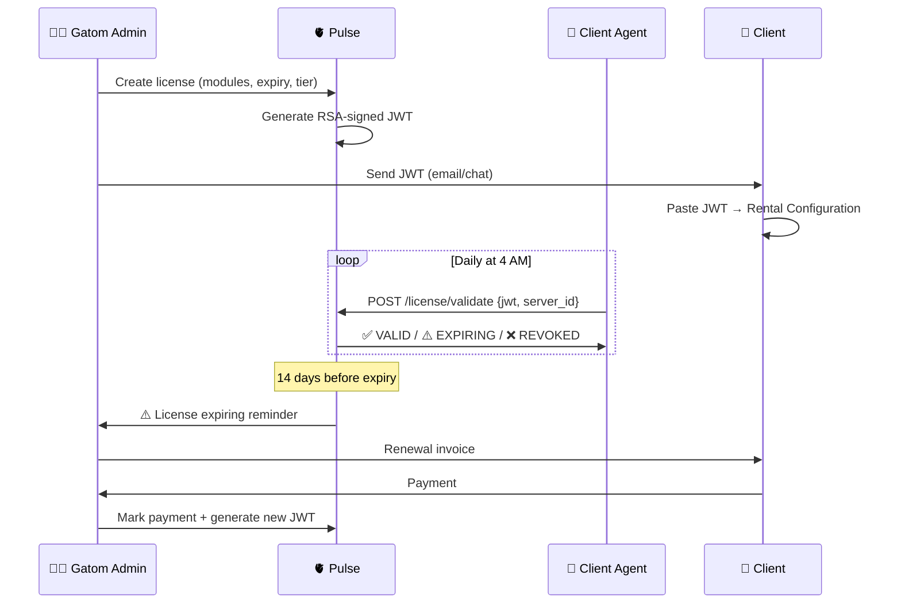
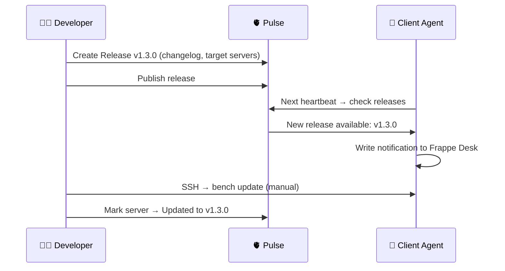

# Gatom Pulse — Platform Overview

> **Product**: Gatom Pulse
> **Type**: Internal Operations Command Center
> **Purpose**: Architecture summary, feature map, and user personas — one-page reference for all stakeholders
> **Status**: Architecture Design

---

## 1. What This Platform Does

Gatom Pulse is the **internal nerve center** Gatom uses to operate and monetize every deployed client server. It replaces disconnected tools (SSH for logs, spreadsheets for licenses, email chains for incidents) with a single platform the team uses before, during, and after selling any product.

**Without Pulse**, Gatom cannot safely sell the rental platform — there is no way to know if a client's server is down, no automated license enforcement, no structured billing, and no visibility into usage.

Pulse ships as **two components**:
1. **`gatom_pulse`** — A Frappe app installed on Gatom's own ERPNext server (the command center)
2. **`gatom_agent`** — A lightweight Frappe app installed on every client server (the data collector)

---

## 2. Architecture

| Layer | Technology | Role |
|---|---|---|
| **Pulse Backend** | Frappe 15, Python 3.11+ | DocTypes, business logic, API endpoints, scheduler |
| **Pulse Frontend** | React + `frappe-react-sdk` | Custom premium dashboard UI |
| **Charts** | Recharts / Chart.js | Time-series metrics, sparklines, revenue charts |
| **Real-time** | Frappe Socketio (built-in) | Live log streaming, server status updates |
| **Time-series State** | Redis (Frappe's built-in) | Real-time heartbeat state + daily aggregation to DocType |
| **Auth** | Frappe session (built-in) | Session-based for dashboard; API key for agents |
| **Licensing** | PyJWT + RSA-2048 | Cryptographically signed license tokens |
| **Billing** | ERPNext Subscription + Sales Invoice | Reuses ERPNext's existing accounting engine |
| **Tickets** | ERPNext HD Ticket (extended) | Support ticket system with custom fields |
| **Email** | Frappe Email (built-in) | Transactional alerts, digests, reminders |
| **Agent** | Frappe app (`gatom_agent`) | Lightweight data collector on client servers |

---

## 3. Push Architecture — Why Agents Push (Not Pull)

The agent **pushes** data outbound to Pulse. Pulse does **not** reach into client servers.

| Concern | Push Architecture | Pull Architecture |
|---|---|---|
| Firewalls | ✅ Client outbound only — no ports to open | ❌ Requires open inbound port on client |
| Security | ✅ Client controls what's shared | ❌ Pulse needs SSH/API credentials to all servers |
| Network requirements | ✅ Only needs standard internet access | ❌ Requires VPN, tunnels, or IP whitelisting |
| Implementation complexity | ✅ Simple HTTP POST from agent | ❌ Complex credential vault management |
| Failure mode | ✅ Agent queues locally if Pulse unreachable | ❌ Pulse blind to offline servers |

---

## 4. Feature Map

| Domain | Key Capabilities |
|---|---|
| **P00: Configuration & Cross-Cutting** | Pulse Configuration singleton, rate limiting, replay prevention, timezone policy, API error contracts, self-monitoring |
| **P01: Client & Server Registry** | Client CRM, server enrollment, API key lifecycle, ERPNext Customer sync, fleet inventory |
| **P02: Server Health Monitoring** | 60-second heartbeats, CPU/RAM/Disk thresholds, uptime tracking, status state machine |
| **P03: Log Aggregation** | Remote log tailing, structured parsing, keyword search, configurable retention, auto-purge |
| **P04: Error Tracking** | Error fingerprinting (agent-computed), issue inbox, regression detection, cross-fleet deduplication |
| **P05: Alerting** | Email + WhatsApp alerts, configurable thresholds, per-client rules, digest mode |
| **P06: Tickets** | Incident auto-creation, support requests, SLA tracking, timeline logging |
| **P07: Licensing** | RSA-signed JWT issuance, online + offline validation, revocation, module gating |
| **P08: Billing** | Subscription tracking, payment logging, MRR/ARR analytics, overdue escalation |
| **P09: Usage Analytics** | Asset counts, user counts, feature adoption, engagement scoring, tier compliance |
| **P10: Releases & Backups** | Version management, changelog distribution, backup verification, fleet adoption tracking |

---

## 5. User Personas

| Persona | Role | Description | Primary Touchpoint |
|---|---|---|---|
| 🧑‍💻 **Gatom Developer** | Pulse Admin | Builds and deploys products. Issues licenses, reads logs, debugs errors, manages releases. | Pulse Dashboard (React) |
| 📋 **Gatom Operations** | Pulse Viewer | Monitors server health, handles tickets, tracks billing, contacts clients. | Pulse Dashboard (React) |
| 🤖 **Client Agent** | System (automated) | The `gatom_agent` app on each client server. Pushes heartbeats, logs, usage data. Not a human. | Pulse REST API |

> [!NOTE]
> **Clients do NOT access Pulse.** It is a purely internal tool. Clients interact with their own Frappe Desk and the rental platform's web/mobile portals. Gatom manages their servers through Pulse behind the scenes.

---

## 6. Pulse Agent Summary

The `gatom_agent` is a minimal Frappe app installed alongside `rental_core` on every client server.

> **For agent installation, file structure, self-diagnostics, and pre-deployment mode** — see [[Agent Overview|🤖 Agent Overview]].
> **For agent domain-specific functional specs** — see `agent-functional.md` in each Pulse domain folder.

| Property | Value |
|---|---|
| **Type** | Frappe app |
| **Install** | `bench install-app gatom_agent` |
| **Dependencies** | None (standalone — does not depend on `rental_core`) |
| **Weight** | < 10 Python files, no DocTypes with UI, no web templates |
| **Auth** | API key stored in `site_config.json` (not in database) |
| **Failure mode** | Queues locally in Redis with exponential backoff; max 24h retention |
| **Transport** | HTTPS POST with `X-Request-Timestamp` and `X-Request-ID` headers |

**Scheduler Events**:

| Frequency | Job | Purpose |
|---|---|---|
| Every 60 sec | `send_heartbeat` | Push system health metrics |
| Every 5 min | `push_logs` | Push new log entries (max 500/batch) |
| Daily 2 AM | `push_usage_stats` | Push usage metrics |
| Daily 3 AM | `check_backup_status` | Verify and push backup status |
| Daily 4 AM | `validate_license` | License check with Pulse (offline fallback) |
| On startup | `register_server` | Ensure server registered with Pulse |

---

## 7. Data Flow Overview

### Flow 1: Server Goes Down

### Flow 2: License Lifecycle

### Flow 3: New Release

---

## 8. Security Model

| Concern | Mitigation |
|---|---|
| Agent impersonation | API keys are UUID v4, hashed with SHA-256 in Pulse DB, transmitted over HTTPS only |
| Replay attacks | Every request includes `X-Request-Timestamp` (±300s tolerance) and `X-Request-ID` (deduplication) |
| Rate abuse / DoS | Per-server rate limits on all agent endpoints (configurable in Pulse Configuration) |
| API key rotation | Dual-key grace period (default 1h) — both old and new keys valid during rotation |
| Pulse API exposure | All agent endpoints require valid `Authorization: Bearer {api_key}` header |
| License forgery | RSA-2048 private key stored in Pulse environment secrets; JWTs mathematically unforgeable |
| Log data sensitivity | Agent strips passwords, secrets, and API keys from logs before push (regex filter) |
| Dashboard access | Internal Frappe auth — strong password + 2FA; not publicly routable |
| Database access | MariaDB only accessible from localhost; no public database port |
| Agent scope | Agent has READ-ONLY access to client data; cannot modify client DocTypes |
| IP whitelisting | Optional Nginx-level IP restriction for agent endpoints (recommended for production) |

> [!TIP]
> See [[P00 - Configuration/functional|P00 — Configuration]] §3–5 for rate limiting, replay prevention, and key rotation implementation details.

---

## 9. Phased Rollout

### Phase 1 — Foundation (Before first client sale)
> **Gate**: Cannot sell any product until Phase 1 is complete.

| Domain | What's Built |
|---|---|
| P00 | Pulse Configuration singleton (thresholds, rate limits, security settings) |
| P01 | Client & Server Registry (DocTypes + React UI + ERPNext Customer sync) |
| P02 | Server Health Monitoring (heartbeat + status dashboard) |
| P07 | Licensing Engine (JWT issuance + validation + dashboard) |
| P08 | Billing Tracking (subscription records + payment logging) |
| Agent | `gatom_agent` v1 (heartbeat + license validation + offline queue) |

### Phase 2 — Operations (After first 1–2 client deployments)

| Domain | What's Built |
|---|---|
| P03 | Log Aggregation & Viewer |
| P04 | Error Tracking & Deduplication |
| P05 | Alerting (email channel) |
| P06 | Ticket System |
| P10 | Backup Monitoring |

### Phase 3 — Intelligence (Growth phase)

| Domain | What's Built |
|---|---|
| P09 | Usage Analytics |
| P10 | Changelog/Release Management |
| P05 | WhatsApp alerting |
| P08 | Revenue analytics (MRR/ARR charts) |

---

## 10. Integration Points

| System | Direction | Purpose |
|---|---|---|
| Client `gatom_agent` | Inbound (receive) | Heartbeats, logs, usage, backup status, license validation |
| ERPNext (Gatom's own) | Internal | Subscription, Sales Invoice, Payment Entry for client billing |
| ERPNext HD Ticket | Internal | Support ticket lifecycle |
| Email (Frappe built-in) | Outbound | Alerts, reminders, digests |
| WhatsApp (Twilio) | Outbound | Critical alerts |
| RSA Key Pair | Internal | License JWT signing (private key in env) |

---

## 🔗 Related

- [[Pulse MOC|🫀 Pulse MOC]]
- [[API Contract|📜 API Contract — Endpoints, Payloads, Scheduler, Audit]]
- [[Agent Overview|🤖 Agent Overview — Installation, File Structure, Self-Diagnostics]]
- [[P00 - Configuration/functional|⚙️ Pulse Configuration & Cross-Cutting]]
- [[../../Gatom MOC|🗺 Gatom MOC]]
- [[../../In House Products/Asset Rental/Asset Rental MOC|🏢 Asset Rental MOC]]

