# Implementation Plan — Exchange & Markups Management Module

**Module**: `websers_exchange_pricing`
**Target**: Odoo 19 · Python 3.12
**Source Analysis**: [Crew Analysis](file:///C:/Users/Mexyz/.gemini/antigravity/brain/94f8eb9f-886d-47d1-a814-f5090e5d1365/exchange_markups_crew_analysis.md) · [Validation](file:///C:/Users/Mexyz/.gemini/antigravity/brain/94f8eb9f-886d-47d1-a814-f5090e5d1365/exchange_markups_validation.md) · [Odoo 19 Notes](file:///C:/Users/Mexyz/.gemini/antigravity/brain/94f8eb9f-886d-47d1-a814-f5090e5d1365/exchange_markups_odoo19.md)
**Dependencies**: `base`, `mail` — **NO dependency on `websers_exchange`**

---

## Confirmed Decisions

| # | Decision |
|---|----------|
| D1 | LYD / LYDB are separate `res.currency` records |
| D2 | Presets = named templates (e.g., "Normal", "Weekend") |
| D3 | Standalone module — no link to `websers_exchange` in Stage 1 |
| D4 | Commission tiers per crypto currency |
| D5 | Spread amounts in foreign currency |
| D6 | Commission hierarchy ≥ as stated, with soft warning |
| D7 | 30-second price cache, configurable |
| D8 | Preset switching is instant with audit log |

---

## Phase 1 — Foundation (Models, Security, Settings)

**Goal**: All database models, security groups, and settings installed and functional.

---

### EX-1.1 — Module Scaffold 🟢
**Effort**: 1h · **Depends on**: Nothing

**Files to create**:

```
websers_exchange_pricing/
├── __init__.py
├── __manifest__.py
├── models/__init__.py
├── services/__init__.py
├── wizard/__init__.py
├── security/
├── views/
├── report/
└── data/
```

**`__manifest__.py`**:
```python
{
    'name': 'Websers Exchange Pricing',
    'version': '19.0.1.0.0',
    'category': 'Websers',
    'summary': 'Exchange rate, spread, and commission management with price calculation engine',
    'author': 'Websers',
    'depends': ['base', 'mail'],
    'data': [
        'security/security.xml',
        'security/ir.model.access.csv',
        'data/pricing_config_data.xml',
        'data/default_preset_data.xml',
        'views/res_currency_views.xml',
        'views/exchange_price_views.xml',
        'views/exchange_price_history_views.xml',
        'views/spread_preset_views.xml',
        'views/spread_views.xml',
        'views/crypto_commission_views.xml',
        'views/res_config_settings_views.xml',
        'views/menus.xml',
        'report/price_card_report.xml',
    ],
    'installable': True,
    'application': True,
    'auto_install': False,
    'license': 'LGPL-3',
}
```

**Acceptance**: Module installs without errors on a clean Odoo 19 database.

---

### EX-1.2 — Currency Extension (`is_crypto`) 🟢
**Effort**: 3h · **Depends on**: EX-1.1

**File**: `models/res_currency.py`

**Fields**:

| Field | Type | Default | Notes |
|-------|------|---------|-------|
| `is_crypto` | Boolean | `False` | Protected: cannot toggle if accounting entries exist (via `write()` override) |

**Code**:
```python
class ResCurrency(models.Model):
    _inherit = 'res.currency'

    is_crypto = fields.Boolean('Is Cryptocurrency', default=False,
        help='Enable to apply crypto commission tiers on this currency.')

    def write(self, vals):
        if 'is_crypto' in vals:
            AML = self.env.get('account.move.line')
            if AML is not None:
                for currency in self:
                    if currency.is_crypto != vals['is_crypto']:
                        if AML.search_count([('currency_id', '=', currency.id)], limit=1):
                            raise ValidationError(
                                _('Cannot change crypto flag for %s — '
                                  'existing accounting entries reference this currency.',
                                  currency.name))
        return super().write(vals)
```

**View**: Inherit `base.view_currency_form`, add `is_crypto` checkbox after the currency name.

**Acceptance**:
- `is_crypto` toggleable on currencies with no AML entries
- `is_crypto` raises `ValidationError` if AML entries exist
- Field visible on currency form

---

### EX-1.3 — Partner Extension (`customer_type`) 🟢
**Effort**: 2h · **Depends on**: EX-1.1

**File**: `models/res_partner.py`

**Fields**:

| Field | Type | Default | Notes |
|-------|------|---------|-------|
| `customer_type` | Selection | `'retail'` | `[('retail','Retail'), ('wholesale','Wholesale'), ('corporate','Corporate')]` |

**Code**:
```python
class ResPartner(models.Model):
    _inherit = 'res.partner'

    customer_type = fields.Selection([
        ('retail', 'Retail'),
        ('wholesale', 'Wholesale'),
        ('corporate', 'Corporate'),
    ], string='Pricing Tier', default='retail',
       help='Determines which spread/commission tier applies to this customer.')
```

**No view in this module** — the field will appear in:
- `websers_portal` back-office partner view (Session 1, OD-2.4)
- Portal signup (Session 1, OD-1.8)

**Acceptance**: Field exists, defaults to `'retail'`, editable on partner form.

---

### EX-1.4 — Exchange Price + History Models 🔴
**Effort**: 8h · **Depends on**: EX-1.2

**Files**:
- `models/exchange_price.py` — `websers.exchange.price`
- `models/exchange_price_history.py` — `websers.exchange.price.history`

#### Exchange Price Model

| Field | Type | Constraint | Notes |
|-------|------|-----------|-------|
| `currency_id` | Many2one(`res.currency`) | UNIQUE per company | `domain=[('active','=',True)]` |
| `company_id` | Many2one(`res.company`) | Required | Default = current company |
| `market_rate` | Float(16,6) | Required | Margin protection on `write()` |
| `sell_operator` | Selection(`*`, `/`) | Computed, stored | `'*'` if `market_rate >= 1.0` else `'/'` |

```python
_sql_constraints = [
    ('currency_company_unique', 'UNIQUE(currency_id, company_id)',
     'Only one exchange price per currency per company.'),
]

sell_operator = fields.Selection(
    [('*', 'Multiply (×)'), ('/', 'Divide (÷)')],
    compute='_compute_sell_operator', store=True)

@api.depends('market_rate')
def _compute_sell_operator(self):
    for rec in self:
        rec.sell_operator = '*' if rec.market_rate >= 1.0 else '/'
```

**Margin protection on `write()`**:
```python
def write(self, vals):
    if 'market_rate' in vals:
        threshold = float(self.env['ir.config_parameter'].sudo().get_param(
            'websers_exchange_pricing.rate_margin_protection', '0.25'))
        for record in self:
            delta = abs(vals['market_rate'] - record.market_rate)
            if delta > threshold:
                if not self.env.user.has_group(
                        'websers_exchange_pricing.group_pricing_admin'):
                    raise UserError(_(
                        'Rate change of %.4f for %s exceeds margin protection (%.4f). '
                        'Only pricing admins can make changes this large.',
                        delta, record.currency_id.name, threshold))
            # Log to history
            self.env['websers.exchange.price.history'].sudo().create({
                'currency_id': record.currency_id.id,
                'company_id': record.company_id.id,
                'old_rate': record.market_rate,
                'new_rate': vals['market_rate'],
                'operator_changed': (
                    ('*' if record.market_rate >= 1.0 else '/') !=
                    ('*' if vals['market_rate'] >= 1.0 else '/')
                ),
            })
    return super().write(vals)
```

**Operator change warning** (`@api.onchange`):
```python
@api.onchange('market_rate')
def _onchange_market_rate_warning(self):
    if self.market_rate and self._origin.market_rate:
        old_op = '*' if self._origin.market_rate >= 1.0 else '/'
        new_op = '*' if self.market_rate >= 1.0 else '/'
        if old_op != new_op:
            return {'warning': {
                'title': _('⚠️ Operator Changed!'),
                'message': _(
                    'Sell operator changed from %s to %s. '
                    'Verify spread values for this currency.', old_op, new_op),
            }}
```

#### Exchange Price History Model

| Field | Type | Notes |
|-------|------|-------|
| `currency_id` | Many2one(`res.currency`) | Primary reference |
| `company_id` | Many2one(`res.company`) | |
| `old_rate` | Float(16,6) | Readonly |
| `new_rate` | Float(16,6) | Readonly |
| `operator_changed` | Boolean | Flag if sell_operator flipped |
| `changed_by` | Many2one(`res.users`) | Default `env.uid` |
| `change_date` | Datetime | Default `fields.Datetime.now` |

All fields **readonly**. Accessible only to `group_pricing_admin`.

**Acceptance**:
- Create exchange price for USD → rate saved, `sell_operator` computed as `*`
- Update rate → history record created with old/new values
- Change rate beyond threshold (0.25) as non-admin → `UserError`
- Change rate beyond threshold as admin → success
- Change rate from 1.05 to 0.95 → `operator_changed = True` + UI warning

---

### EX-1.5 — Spread Preset Model 🟡
**Effort**: 4h · **Depends on**: EX-1.1

**File**: `models/spread_preset.py` — `websers.spread.preset`

| Field | Type | Notes |
|-------|------|-------|
| `name` | Char | Required, UNIQUE per company |
| `is_active` | Boolean | Default `False`, single-active logic |
| `description` | Text | Optional notes |
| `company_id` | Many2one(`res.company`) | Default = current company |
| `line_ids` | One2many → `websers.spread` | Cascade delete |

```python
_sql_constraints = [
    ('name_company_unique', 'UNIQUE(name, company_id)',
     'Preset name must be unique per company.'),
]
```

**Actions**:

1. **`action_activate()`** — single-active with `FOR UPDATE` lock:
```python
def action_activate(self):
    self.ensure_one()
    self.env.cr.execute(
        "SELECT id FROM websers_spread_preset WHERE company_id = %s FOR UPDATE",
        [self.env.company.id])
    self.search([
        ('id', '!=', self.id),
        ('is_active', '=', True),
        ('company_id', '=', self.env.company.id),
    ]).write({'is_active': False})
    self.is_active = True
    self.message_post(body=_('Preset activated by %s', self.env.user.name))
```

2. **`action_duplicate_as_template()`** — copy with "(Copy)" suffix
3. **`action_populate_pairs()`** — create spread lines for all active currencies missing from this preset:
```python
def action_populate_pairs(self):
    self.ensure_one()
    base = self.env.company.currency_id
    existing = self.line_ids.mapped('pair_currency_id')
    missing = self.env['res.currency'].search([
        ('active', '=', True),
        ('id', '!=', base.id),
        ('id', 'not in', existing.ids),
    ])
    for currency in missing:
        self.env['websers.spread'].create({
            'preset_id': self.id,
            'currency_id': base.id,
            'pair_currency_id': currency.id,
            'retail_amount_to': 499.99,
            'company_id': self.env.company.id,
        })
    return True
```

**Acceptance**:
- Create preset → inactive by default
- Activate → previous active deactivated, message logged
- Duplicate → new preset with "(Copy)", inactive
- Populate pairs → one line per active non-base currency

---

### EX-1.6 — Spread Model 🔴
**Effort**: 6h · **Depends on**: EX-1.5

**File**: `models/spread.py` — `websers.spread`

| Field | Type | Notes |
|-------|------|-------|
| `preset_id` | Many2one → `websers.spread.preset` | Required, cascade |
| `currency_id` | Many2one(`res.currency`) | Base currency (LYD) |
| `pair_currency_id` | Many2one(`res.currency`) | Foreign currency |
| `company_id` | Many2one(`res.company`) | |
| `retail_amount_from` | Float | **Locked at 0**, readonly |
| `retail_amount_to` | Float | Required |
| `retail_buy_spread` | Float(16,6) | Positive, margin protection |
| `retail_sell_spread` | Float(16,6) | Positive, margin protection |
| `wholesale_amount_from` | Float | **Computed** = `retail_amount_to + 0.01` |
| `wholesale_amount_to` | Float | Default 0 (unlimited) |
| `wholesale_buy_spread` | Float(16,6) | Positive, margin protection |
| `wholesale_sell_spread` | Float(16,6) | Positive, margin protection |
| `corporate_buy_spread` | Float(16,6) | Positive, margin protection |
| `corporate_sell_spread` | Float(16,6) | Positive, margin protection |

```python
_sql_constraints = [
    ('pair_preset_company_unique',
     'UNIQUE(currency_id, pair_currency_id, preset_id, company_id)',
     'Only one spread per currency pair per preset per company.'),
]
```

**Margin protection on `write()`**: soft confirmation — if any spread field change exceeds the threshold (`spread_margin_protection`, default 0.10), log a warning to chatter but DO NOT block:
```python
def write(self, vals):
    threshold = float(self.env['ir.config_parameter'].sudo().get_param(
        'websers_exchange_pricing.spread_margin_protection', '0.10'))
    spread_fields = [
        'retail_buy_spread', 'retail_sell_spread',
        'wholesale_buy_spread', 'wholesale_sell_spread',
        'corporate_buy_spread', 'corporate_sell_spread',
    ]
    for field_name in spread_fields:
        if field_name in vals:
            for record in self:
                old_val = getattr(record, field_name) or 0.0
                delta = abs(vals[field_name] - old_val)
                if delta > threshold:
                    record.preset_id.message_post(body=_(
                        '⚠️ Large spread change on %s/%s: '
                        '%s changed by %.4f (threshold: %.4f) by %s',
                        record.currency_id.name,
                        record.pair_currency_id.name,
                        field_name, delta, threshold,
                        self.env.user.name))
    return super().write(vals)
```

**Asymmetry warning** (`@api.constrains`):
```python
@api.constrains('retail_buy_spread', 'retail_sell_spread',
                'wholesale_buy_spread', 'wholesale_sell_spread',
                'corporate_buy_spread', 'corporate_sell_spread')
def _check_positive_spreads(self):
    for rec in self:
        for field_name in ['retail_buy_spread', 'retail_sell_spread',
                           'wholesale_buy_spread', 'wholesale_sell_spread',
                           'corporate_buy_spread', 'corporate_sell_spread']:
            val = getattr(rec, field_name)
            if val and val < 0:
                raise ValidationError(
                    _('Spread values must be positive. Check %s.', field_name))
```

**Acceptance**:
- Create spread line for LYD/USD in "Normal" preset → saved
- `retail_amount_from` always 0, readonly
- `wholesale_amount_from` auto-computes from `retail_amount_to`
- Large spread change → warning logged in preset chatter
- Negative spread → `ValidationError`

---

### EX-1.7 — Crypto Commission Models 🟡
**Effort**: 6h · **Depends on**: EX-1.2

**Files**:
- `models/crypto_commission_rule.py` — `websers.crypto.commission.rule`
- `models/crypto_commission_tier.py` — `websers.crypto.commission.tier`

#### Commission Rule (Parent)

| Field | Type | Notes |
|-------|------|-------|
| `currency_id` | Many2one(`res.currency`) | `domain=[('is_crypto','=',True)]`, UNIQUE per company |
| `company_id` | Many2one(`res.company`) | |
| `tier_ids` | One2many → tier | |

#### Commission Tier (Child)

| Field | Type | Notes |
|-------|------|-------|
| `rule_id` | Many2one → rule | Cascade, required |
| `amount_from` | Float | |
| `amount_to` | Float | 0 = unlimited |
| `retail_buy_commission` | Float(16,4) | Allow negative |
| `retail_sell_commission` | Float(16,4) | Allow negative |
| `wholesale_buy_commission` | Float(16,4) | Soft constraint ≥ retail |
| `wholesale_sell_commission` | Float(16,4) | Soft constraint ≥ retail |
| `corporate_buy_commission` | Float(16,4) | Soft constraint ≥ wholesale |
| `corporate_sell_commission` | Float(16,4) | Soft constraint ≥ wholesale |

**Tier no-gap validation** (`@api.constrains` on `amount_from`, `amount_to`):
```python
@api.constrains('amount_from', 'amount_to')
def _check_tier_continuity(self):
    for tier in self:
        all_tiers = tier.rule_id.tier_ids.sorted('amount_from')
        for i in range(1, len(all_tiers)):
            prev = all_tiers[i - 1]
            curr = all_tiers[i]
            if prev.amount_to == 0:
                raise ValidationError(_(
                    'Tier ending at "unlimited" must be last. '
                    'Move tier %s–%s to the end.', prev.amount_from, prev.amount_to))
            expected = prev.amount_to + 1  # integer step
            if curr.amount_from != expected:
                raise ValidationError(_(
                    'Gap detected: tier ending at %s must be followed by tier starting at %s, '
                    'but found %s.', prev.amount_to, expected, curr.amount_from))
```

**Hierarchy constraint** (soft warning via chatter, not hard block):
```python
@api.constrains('wholesale_buy_commission', 'retail_buy_commission',
                'corporate_buy_commission', 'wholesale_sell_commission',
                'retail_sell_commission', 'corporate_sell_commission')
def _check_hierarchy_warning(self):
    for tier in self:
        warnings = []
        if tier.wholesale_buy_commission < tier.retail_buy_commission:
            warnings.append('wholesale_buy < retail_buy')
        if tier.corporate_buy_commission < tier.wholesale_buy_commission:
            warnings.append('corporate_buy < wholesale_buy')
        if tier.wholesale_sell_commission < tier.retail_sell_commission:
            warnings.append('wholesale_sell < retail_sell')
        if tier.corporate_sell_commission < tier.wholesale_sell_commission:
            warnings.append('corporate_sell < wholesale_sell')
        if warnings:
            tier.rule_id.message_post(body=_(
                '⚠️ Commission tier %s–%s: hierarchy check flagged: %s. '
                'Verify this is intentional.',
                tier.amount_from, tier.amount_to or '∞',
                ', '.join(warnings)))
```

**Acceptance**:
- Create rule for USDT with 6 tiers → saved
- Gap between tiers → `ValidationError`
- Tier with `amount_to = 0` not at end → `ValidationError`
- `wholesale_buy < retail_buy` → chatter warning (NOT a block)
- Negative commission values allowed (e.g., -0.30%)

---

### EX-1.8 — Settings (Margin Protection) 🟢
**Effort**: 2h · **Depends on**: EX-1.1

**File**: `models/res_config_settings.py`

**Fields on `res.config.settings`**:

| Field | Config Parameter | Default |
|-------|-----------------|:-------:|
| `exchange_margin_protection` | `websers_exchange_pricing.rate_margin_protection` | 0.25 |
| `spread_margin_protection` | `websers_exchange_pricing.spread_margin_protection` | 0.10 |
| `commission_margin_protection` | `websers_exchange_pricing.commission_margin_protection` | 0.10 |
| `price_cache_ttl` | `websers_exchange_pricing.price_cache_ttl` | 30 |

**Data file** (`data/pricing_config_data.xml`): set default values via `ir.config_parameter`.

**Acceptance**: Settings page shows margin protection fields. Changing the value updates `ir.config_parameter`.

---

### EX-1.9 — Security (Odoo 19 Privilege System) 🟡
**Effort**: 4h · **Depends on**: ALL EX-1.x models

**Files**:
- `security/security.xml` — groups, privileges, record rules
- `security/ir.model.access.csv` — model-level ACL

**Odoo 19 3-tier structure**:

```
ir.module.category: "Exchange Pricing"
├── res.groups.privilege: "Exchange Rate Management"
│   ├── res.groups: "Price Viewer"       (view prices)
│   └── res.groups: "Price Editor"       (update rates, implies Viewer)
└── res.groups.privilege: "Spread & Commission Management"
    ├── res.groups: "Spread Editor"      (update spreads/commissions, implies Viewer)
    └── res.groups: "Pricing Admin"      (override protections, view history, implies all)
```

**ACL matrix** (`ir.model.access.csv`):

| Model | Viewer | Price Editor | Spread Editor | Admin |
|-------|:------:|:------------:|:-------------:|:-----:|
| `websers.exchange.price` | R | CRUD | R | CRUD |
| `websers.exchange.price.history` | — | — | — | R |
| `websers.spread.preset` | R | R | CRUD | CRUD |
| `websers.spread` | R | R | CRUD | CRUD |
| `websers.crypto.commission.rule` | R | R | CRUD | CRUD |
| `websers.crypto.commission.tier` | R | R | CRUD | CRUD |
| `websers.price.calculation` | R | R | R | R |

**Record rules**: Company isolation on all models via `[('company_id', 'in', company_ids)]`.

**Acceptance**: Each group can only perform allowed operations. History visible only to admin.

---

## Phase 2 — Business Logic (Services, Wizards)

**Goal**: Price calculation engine and bulk operations functional.

---

### EX-2.1 — Price Calculation Service (AbstractModel) 🔴
**Effort**: 10h · **Depends on**: EX-1.4, EX-1.6, EX-1.7

**File**: `models/price_calculation.py` — `websers.price.calculation`

**Type**: `models.AbstractModel` (no database table)

**Methods**:

#### `calculate(currency_id, amount, customer_type, direction)`

**Input**:
| Param | Type | Required | Default |
|-------|------|:--------:|---------|
| `currency_id` | int | ✅ | — |
| `amount` | float | ✅ | — |
| `customer_type` | str | — | `'retail'` |
| `direction` | str | — | `'sell'` |

**Output** (dict):
```python
{
    'market_rate': float,
    'sell_operator': str,        # '*' or '/'
    'preset_name': str,
    'spread_applied': float,
    'customer_rate': float,      # rate after spread
    'commission_rate': float,    # % (0 if non-crypto)
    'commission_amount': float,  # absolute (0 if non-crypto)
    'final_amount': float,       # rounded to 2 decimals
    'customer_type': str,
    'direction': str,
}
```

**Algorithm** (see [crew analysis Section 4](file:///C:/Users/Mexyz/.gemini/antigravity/brain/94f8eb9f-886d-47d1-a814-f5090e5d1365/exchange_markups_crew_analysis.md) for the full walkthrough):

1. **Market Rate**: Lookup `websers.exchange.price` by `currency_id` + `company_id`
2. **Active Preset**: Find single active `websers.spread.preset` — fail if none
3. **Spread Lookup**: Find `websers.spread` by pair + preset
4. **Tier Selection**: By `customer_type` and `amount` threshold
5. **Apply Spread**:
   - If `sell_operator == '*'`: sell → `rate + spread`, buy → `rate - spread`
   - If `sell_operator == '/'`: sell → `rate - spread`, buy → `rate + spread`
   - Guard: `customer_rate <= 0` → error
6. **Crypto Commission**: If `currency.is_crypto`, find tier, apply percentage
7. **Return result dict**

#### `calculate_all_display_prices(customer_type, reference_amount)`

Calculates buy/sell rates for ALL active currencies. Used by display boards and API endpoints.

- `reference_amount=None` → uses 1.0 (unit rate for retail)
- `reference_amount=1000` → uses 1000 (shows wholesale rate if above threshold)

#### Cache

In-memory per-worker cache with configurable TTL:
```python
_cache = {}
_cache_time = {}

def _get_cache_ttl(self):
    return int(self.env['ir.config_parameter'].sudo().get_param(
        'websers_exchange_pricing.price_cache_ttl', '30'))

def invalidate_cache(self):
    type(self)._cache = {}
    type(self)._cache_time = {}
```

Invalidation hooks added to `write()` of: `websers.exchange.price`, `websers.spread`, `websers.crypto.commission.tier`, `websers.spread.preset` (on activate).

**Tests** (critical — this is the money-making/losing code):

| Test | Input | Expected |
|------|-------|----------|
| Multiply sell | USD rate=10.12, sell_spread=0.05, amount=100, sell | customer_rate=10.17, final=1017.00 |
| Multiply buy | USD rate=10.12, buy_spread=0.05, amount=100, buy | customer_rate=10.07, final=1007.00 |
| Divide sell | EGP rate=0.184, sell_spread=0.01, amount=1000, sell | customer_rate=0.174, final=5747.13 |
| Divide buy | EGP rate=0.184, buy_spread=0.01, amount=1000, buy | customer_rate=0.194, final=5154.64 |
| Corporate | USD, corporate, amount=any | Uses corporate_spread |
| Wholesale | USD, retail, amount=1000 (above retail_amount_to=499) | Uses wholesale_spread |
| Crypto sell | USDT, amount=50, retail, sell | Applies 4.0% sell commission |
| Crypto buy | USDT, amount=any, retail, buy | Applies -0.30% (discount) |
| Missing price | New currency with no exchange price | `UserError` |
| No active preset | All presets inactive | `UserError` |
| Inactive currency | `active=False` | `UserError` |
| Spread → 0 | Divide currency with spread > rate | `UserError` (rate ≤ 0) |

**Acceptance**: All 12 test cases pass.

---

### EX-2.2 — Spread Bulk Update Wizard 🟡
**Effort**: 4h · **Depends on**: EX-1.6

**File**: `wizard/spread_bulk_wizard.py` + `views/spread_bulk_wizard_views.xml`

**Model**: `websers.spread.bulk.wizard` (TransientModel)

| Field | Type | Notes |
|-------|------|-------|
| `preset_id` | Many2one → preset | Default = active preset |
| `pair_currency_id` | Many2one(`res.currency`) | Optional — null = all pairs |
| `direction` | Selection | `buy` / `sell` / `both` |
| `tier` | Selection | `retail` / `wholesale` / `corporate` / `all` |
| `delta` | Float | +/- value to apply |
| `preview_line_ids` | One2many → preview lines | Computed on "Preview" |

**Flow**:
1. Staff fills in parameters, clicks "Preview"
2. Preview shows table: Pair | Field | Current | New
3. Staff clicks "Apply"
4. Updates all matching spreads in a single transaction with margin protection checks

**Acceptance**: Bulk +0.02 on all USD sell spreads → all sell spread fields updated. Preview shows correct values before apply.

---

### EX-2.3 — Commission Bulk Set Wizard 🟢
**Effort**: 2h · **Depends on**: EX-1.7

**File**: `wizard/commission_bulk_set_wizard.py` + view

**Model**: `websers.commission.bulk.wizard` (TransientModel)

| Field | Type | Notes |
|-------|------|-------|
| `rule_id` | Many2one → rule | Context-default |
| `field_target` | Selection | `buy` / `sell` |
| `value` | Float | The value to set across ALL tiers |

**Action**: Sets all `retail_buy_commission`, `wholesale_buy_commission`, `corporate_buy_commission` (or sell) across all tiers to the given value.

**Use case**: Buy commission is -0.30% flat across all tiers (Image 2). Instead of filling -0.30 six times, staff fills once and clicks "Apply."

---

## Phase 3 — Views & UX

**Goal**: All back-office views, menus, and reports functional.

> [!IMPORTANT]
> All views use Odoo 19 `<list>` tag (NOT `<tree>`). All window actions use `view_mode="list,form"`.

---

### EX-3.1 — Exchange Price Views 🟡
**Effort**: 4h · **Depends on**: EX-1.4

**Exchange Price List** — Single-screen management (editable list):
```xml
<list editable="bottom" multi_edit="1">
    <field name="currency_id"/>
    <field name="market_rate"/>
    <field name="sell_operator" readonly="1"/>
    <field name="company_id" column_invisible="1"/>
</list>
```

**Exchange Price Form** — For detail view with history smart button:
- Market rate field (large, prominent)
- Sell operator (readonly, computed)
- Smart button "History" → opens filtered history view

**Missing currency banner**: At top of list view, show warning if active currencies have no exchange price.

---

### EX-3.2 — Exchange Price History Views 🟢
**Effort**: 2h · **Depends on**: EX-1.4

Readonly list view: `currency_id`, `old_rate`, `new_rate`, `operator_changed`, `changed_by`, `change_date`

**Filter**: By currency, by date range, "Operator Changed" quick filter.

Accessible only to `group_pricing_admin`.

---

### EX-3.3 — Spread Preset Views 🟡
**Effort**: 4h · **Depends on**: EX-1.5

**Preset List View**:
```xml
<list>
    <field name="name"/>
    <field name="is_active" widget="boolean_toggle"/>
    <field name="description"/>
    <button name="action_activate" string="Activate"
            invisible="is_active" type="object"
            groups="websers_exchange_pricing.group_spread_editor"/>
</list>
```

**Preset Form View**:
- Header with "Activate", "Populate All Pairs", "Duplicate" buttons
- `is_active` status indicator
- `name`, `description`
- Notebook page: "Spread Lines" → embedded inline `websers.spread` list
- Chatter for audit trail

---

### EX-3.4 — Spread Inline Views 🟡
**Effort**: 3h · **Depends on**: EX-1.6

Editable inline `<list>` inside the preset form:
```xml
<field name="line_ids">
    <list editable="bottom">
        <field name="pair_currency_id"/>
        <field name="retail_amount_from" readonly="1"/>
        <field name="retail_amount_to"/>
        <field name="retail_buy_spread"/>
        <field name="retail_sell_spread"/>
        <field name="wholesale_amount_from" readonly="1"/>
        <field name="wholesale_amount_to"/>
        <field name="wholesale_buy_spread"/>
        <field name="wholesale_sell_spread"/>
        <field name="corporate_buy_spread"/>
        <field name="corporate_sell_spread"/>
    </list>
</field>
```

Group columns visually: Retail | Wholesale | Corporate (using `<group>` or CSS).

---

### EX-3.5 — Crypto Commission Views 🟡
**Effort**: 3h · **Depends on**: EX-1.7

**Rule Form**: Currency selector + inline tier list, "Set All Buy" / "Set All Sell" buttons

**Tier Inline List**:
```xml
<list editable="bottom">
    <field name="amount_from"/>
    <field name="amount_to"/>
    <field name="retail_sell_commission"/>
    <field name="retail_buy_commission"/>
    <field name="wholesale_sell_commission"/>
    <field name="wholesale_buy_commission"/>
    <field name="corporate_sell_commission"/>
    <field name="corporate_buy_commission"/>
</list>
```

---

### EX-3.6 — Currency + Settings Views 🟢
**Effort**: 2h · **Depends on**: EX-1.2, EX-1.8

**Currency**: Inherit `base.view_currency_form`, add `is_crypto` checkbox.

**Settings**: Inherit settings view, add "Exchange Pricing" section with margin protection fields.

---

### EX-3.7 — Menus 🟢
**Effort**: 1h · **Depends on**: All EX-3.x

```
Exchange Pricing (top menu)
├── Exchange Rates
│   ├── Market Rates          → exchange price list
│   └── Rate History          → history list (admin only)
├── Spreads
│   └── Spread Presets        → preset list
├── Commissions
│   └── Crypto Commissions    → commission rule list
└── Configuration
    └── Settings              → res.config.settings
```

---

### EX-3.8 — Price Card Report 🟢
**Effort**: 3h · **Depends on**: EX-2.1

**File**: `report/price_card_report.xml`

QWeb report that generates a styled price card (PDF) similar to the WhatsApp broadcast format:

```
┌──────────────────────────────────┐
│          💱  أسعار الصرف          │
│        Exchange Rates             │
│     16 Apr 2026 · 16:00           │
├──────────────────────────────────┤
│  Currency     │  Buy   │  Sell   │
├───────────────┼────────┼─────────┤
│  USD/LYD      │ 10.07  │ 10.17  │
│  EUR/LYD      │ 11.52  │ 11.72  │
│  USDT ₿       │ 10.10  │ 10.20  │
└──────────────────────────────────┘
```

Called via a server action on the exchange price list view.

---

## Phase 4 — Portal Integration (Session 1 Updates)

**Goal**: Connect the pricing engine to the portal API so mobile/web apps display correct prices.

> [!WARNING]
> These tasks modify **Session 1** (`websers_portal`). They should be done AFTER the pricing module is deployed and tested.

---

### EX-4.1 — Update Portal Manifest 🟢
**Effort**: 0.5h · **Depends on**: EX-1.1

Add `'websers_exchange_pricing'` to `websers_portal/__manifest__.py` `depends` list.

---

### EX-4.2 — Update Price Controller (OD-3.2) 🟡
**Effort**: 3h · **Depends on**: EX-2.1, EX-4.1

Modify the price controller to call the pricing service:
```python
@http.route('/api/v1/prices', type='http', auth='none', methods=['GET'], cors=cors_origin)
def get_prices(self, **kwargs):
    # ... JWT validation ...
    partner = # resolved from JWT
    prices = request.env['websers.price.calculation'].sudo().calculate_all_display_prices(
        customer_type=partner.customer_type)
    return request.make_json_response({'status': 'success', 'data': prices})
```

---

### EX-4.3 — Public Price Endpoint 🟡
**Effort**: 3h · **Depends on**: EX-2.1, EX-4.1

New endpoint in `websers_portal/controllers/price_controller.py`:
```python
@http.route('/api/v1/public/prices', type='http', auth='public',
            methods=['GET'], cors=cors_origin)
def get_public_prices(self, **kwargs):
    # Rate limit: 60/min by IP
    prices = request.env['websers.price.calculation'].sudo().calculate_all_display_prices(
        customer_type='retail')
    return request.make_json_response({'status': 'success', 'data': prices})
```

**Response shape**:
```json
{
  "status": "success",
  "data": [
    {"currency_id": 2, "currency_name": "USD", "buy_rate": 10.07, "sell_rate": 10.17, "is_crypto": false},
    {"currency_id": 5, "currency_name": "USDT", "buy_rate": 10.10, "sell_rate": 10.20, "is_crypto": true}
  ]
}
```

Update frontend endpoint lists:
- **MB-1.2** (Flutter): Add `Endpoints.publicPrices`
- **WB-1.3** (Next.js): Add public prices endpoint

---

### EX-4.4 — Signup Accepts `customer_type` 🟢
**Effort**: 2h · **Depends on**: EX-1.3

Update Session 1 task **OD-1.8** (Auth Controller / Signup) to accept `customer_type`:
```python
# In signup endpoint:
customer_type = data.get('customer_type', 'retail')
if customer_type not in ('retail', 'wholesale', 'corporate'):
    customer_type = 'retail'
partner.customer_type = customer_type
```

Update Session 1 frontend tasks:
- **MB-1.5** (Flutter): Map company type picker → `customer_type`
- **WB-1.4** (Next.js): Same

---

## Effort Summary

| Phase | Tasks | Effort |
|-------|:-----:|:------:|
| **Phase 1** — Foundation | EX-1.1 → EX-1.9 | **36h** (4.5 days) |
| **Phase 2** — Business Logic | EX-2.1 → EX-2.3 | **16h** (2 days) |
| **Phase 3** — Views & UX | EX-3.1 → EX-3.8 | **22h** (2.75 days) |
| **Phase 4** — Portal Integration | EX-4.1 → EX-4.4 | **8.5h** (1 day) |
| **QA & Testing** | Unit tests + integration | **6h** (0.75 day) |
| **Total** | **22 tasks** | **~88.5h (~11 days)** |

---

## Dependency Graph

```mermaid
gantt
    title Exchange Pricing Module — Task Dependencies
    dateFormat X
    axisFormat %s
    
    section Phase 1
    EX-1.1 Scaffold              :a1, 0, 1
    EX-1.2 Currency is_crypto    :a2, after a1, 3
    EX-1.3 Partner customer_type :a3, after a1, 2
    EX-1.4 Exchange Price+History:a4, after a2, 8
    EX-1.5 Spread Preset         :a5, after a1, 4
    EX-1.6 Spread Model          :a6, after a5, 6
    EX-1.7 Commission Models     :a7, after a2, 6
    EX-1.8 Settings              :a8, after a1, 2
    EX-1.9 Security              :a9, after a6, 4
    
    section Phase 2
    EX-2.1 Price Calc Service    :b1, after a9, 10
    EX-2.2 Spread Bulk Wizard    :b2, after a6, 4
    EX-2.3 Commission Bulk Wizard:b3, after a7, 2
    
    section Phase 3
    EX-3.1 Price Views           :c1, after a4, 4
    EX-3.2 History Views         :c2, after a4, 2
    EX-3.3 Preset Views          :c3, after a5, 4
    EX-3.4 Spread Views          :c4, after a6, 3
    EX-3.5 Commission Views      :c5, after a7, 3
    EX-3.6 Currency+Settings     :c6, after a8, 2
    EX-3.7 Menus                 :c7, after c1, 1
    EX-3.8 Price Report          :c8, after b1, 3
    
    section Phase 4
    EX-4.1 Portal Manifest       :d1, after b1, 1
    EX-4.2 Price Controller      :d2, after d1, 3
    EX-4.3 Public Endpoint       :d3, after d1, 3
    EX-4.4 Signup customer_type  :d4, after a3, 2
```



---

## Verification Plan

### Automated Tests
```bash
# Run all pricing module tests
odoo -d test_db -i websers_exchange_pricing --test-enable --stop-after-init

# Run specific test class
odoo -d test_db -i websers_exchange_pricing --test-tags /websers_exchange_pricing:TestPriceCalculation
```

### Manual Verification
1. Install module on clean Odoo 19 database
2. Create 3 currencies (USD, EUR, USDT) with `is_crypto=True` on USDT
3. Set exchange prices
4. Create "Normal" preset → populate pairs → set spreads
5. Create USDT commission rule with 6 tiers
6. Activate preset → calculate prices → verify formula
7. Test margin protection (change rate by > 0.25 as non-admin)
8. Generate price card report
9. Test via API endpoints (public + authenticated)
